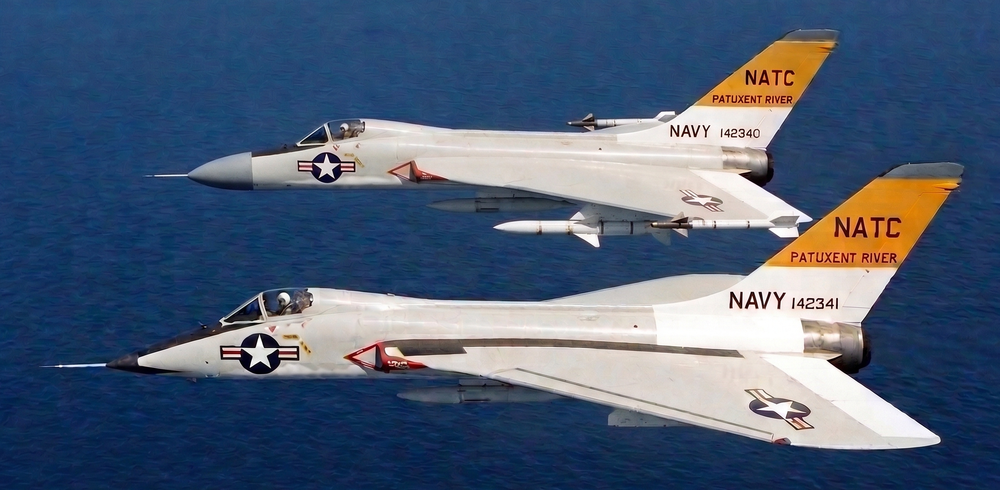

# Douglas F-7 Super Skylancer

| | |
|:---------- |:--------- |
The **Douglas F-7 Super Skylancer** (designated **F5D-2** prior to the 1962 United States Tri-Service designation system) is an American single-seat, supersonic carrier-borne fighter aircraft developed by the Douglas Aircraft Company for the United States Navy. Derived from the earlier J57-powered **[Douglas F5D-1 Skylancer](https://en.wikipedia.org/wiki/Douglas_F5D_Skylancer)**, the design was radically re-engineered around the General Electric J79 afterburning turbojet and featured an expanded, vortex-generating compound ogee delta wing with boundary-layer control blown flaps. Entering fleet service in 1960 to serve as the nimble, single-engine complement to the heavy [McDonnell F-4 Phantom II](https://en.wikipedia.org/wiki/McDonnell_Douglas_F-4_Phantom_II), the Super Skylancer provided all-weather fleet air defense from the modest flight decks of [modernized Essex-class attack carriers](https://en.wikipedia.org/wiki/Essex-class_aircraft_carrier#Post-war_rebuilds). A total of 1,050 airframes were produced across interceptor (**F-7A**) and multirole tactical strike (**F-7B**) variants, seeing extensive frontline service through the Vietnam War, subsequent reserve duty, and a celebrated post-Cold War adversary resurgence as the **F-7N**.   The [Vought F-8 Crusader](https://en.wikipedia.org/wiki/Vought_F-8_Crusader) (designated F8U prior to 1962) was quickly regulated to the RF-8 non-combat role, after a series of endurance and gun tests in 1958, being replaced by the more capable, radar missile equipped, longer loiter and range **F-7**. Despite its radar guided [AIM-7 Sparrow](https://en.wikipedia.org/wiki/AIM-7_Sparrow), unlike the gunless F-4, the **F-7** ended up relying on its guns early in Vietnam, as missiles did not live up to their early promises. Although the F-8 was actually the last American fighter design with guns as the primary weapon, the **F-7** ended up earning the title, "The Last of the Gunfighters." The F-8 design still evolved into the very successful [LTV A-7 Corsair II](https://en.wikipedia.org/wiki/LTV_A-7_Corsair_II)) strike aircraft as part of the multi-service [Heavier than Air, Light(VAL)](https://en.wikipedia.org/wiki/LTV_A-7_Corsair_II#Origins) attack aircraft project. The Douglas' proposed **F/A-7**, using the existing **F-7B** with augmented electonics, was far too ahead of its time.    Coincidentally, Heinemann's concept at Douglas would be resurrected by its successor just 15 years later into the very successful [McDonnell-Douglas F/A-18 Hornet](https://en.wikipedia.org/wiki/McDonnell_Douglas_F/A-18_Hornet), which directly replaced the **F-7** by the 1980s, and then the A-4 and A-7 during the *'Peace Dividend'* of the 1990s.  | **F-7 Super Skylancer**       F5D-1 (foreground) and **F5D-2/F-7A** (background) over the [Naval Air Test Center (NATC) at NAS Patuxent River](https://en.wikipedia.org/wiki/Naval_Air_Station_Patuxent_River) in 1958    **Type:**  Carrier-borne fighter / interceptor   **Manufacturer:**  Douglas Aircraft Company    **First flight:**  14 November 1958   **Introduction:**  Late 1960   **Retired:**  1992 (USNR), 2002 (Adversary F-7N)    **Primary users:**  United States Navy, United States Marine Corps   **Number built:**  • 1,050 (USN/USMC)  • [186 (export)](Douglas_F-7_Super_Skylancer_in_Foreign_Service.md)   **Developed from:**  Douglas F5D-1 Skylancer |

## Design and Development

**Genesis: Heinemann’s Gamble and the J79 Pivot**

In the spring of 1955, as Vought’s XF8U-1 Crusader went supersonic on its maiden flight well ahead of schedule, Douglas chief engineer [Ed Heinemann](https://en.wikipedia.org/wiki/Ed_Heinemann) faced a dangerous two-front procurement squeeze. The baseline F5D-1 Skylancer, saddled with [Pratt & Whitney’s temperamental J57 turbojet](https://en.wikipedia.org/wiki/Pratt_&_Whitney_J57), was aerodynamically refined but clearly trailing [Vought](https://en.wikipedia.org/wiki/Vought)'s delivery timeline. Even more menacing was the threat emerging from Bethpage: [Grumman](https://en.wikipedia.org/wiki/Grumman) was already preparing to mate [General Electric’s revolutionary J79](https://en.wikipedia.org/wiki/Pratt_&_Whitney_J57) turbojet into its sleek, Area-Ruled [Grumman F11F-1 Tiger](https://en.wikipedia.org/wiki/Grumman_F-11_Tiger) airframe to create the Mach 2-capable [F11F-1F Super Tiger](https://en.wikipedia.org/wiki/Grumman_F11F-1F_Super_Tiger). Heinemann realized that if Grumman successfully sold the [Bureau of Aeronautics (BuAer)](https://en.wikipedia.org/wiki/Bureau_of_Aeronautics) on a single-J79 interceptor to serve as the low-cost companion to the emerging twin-J79 F4H Phantom II from [McDonnell](https://en.wikipedia.org/wiki/McDonnell_Aircraft_Corporation) (McDonnell and Douglas would not merge for another dozen years), Douglas would be permanently locked out of naval fighter contracts, relegated solely to attack aircraft.

Rather than rushing a compromised, J57-powered F5D-1 into a losing contest against Vought, Heinemann made an audacious internal pivot. He froze production tooling on the baseline Skylancer and pitched BuAer on an integrated high/low fleet architecture powered by a single common engine family. McDonnell’s heavy twin-J79 Phantom was purpose-built for outer-perimeter barrier defense on the giant new [Forrestal-class supercarriers](https://en.wikipedia.org/wiki/Forrestal-class_aircraft_carrier), but it was far too large and punishing for the dozens of modernized *Essex*-class carriers (SCB-27C/125). Douglas proposed the **F5D-2 "Super Skylancer"** as the nimble, low-cost half of that pair: a single-J79 interceptor under 15,000 pounds empty, designed from day one to operate safely from smaller *Essex* elevators and arresting gear. It was only a single meter longer than the original F5D-1, improving the fitness ratio, and actually lighter thanks to the engine change.

Crucially, Heinemann exploited the fatal vulnerabilities of Grumman's Super Tiger. While the F11F-1F was an aerodynamic hot rod capable of high-altitude speed dashes, its slender, narrow-chord swept wing held a paltry 914 gallons of internal fuel, giving it virtually zero combat loiter time. Furthermore, the Tiger’s needle-like nose could accommodate only a rudimentary radar-ranging gunsight, precluding the carriage of all-weather radar-guided missiles. The F5D-2 countered this by using a broad ogee delta wing offering over 1,250 gallons of internal fuel capacity and an enlarged nose radome housing a 22-inch dish for semi-recessed AIM-7 Sparrows. Capitol Hill initially balked at cutting Vought's Crusader orders to award Douglas a second fighter line alongside the [A4D Skyhawk](https://en.wikipedia.org/wiki/Douglas_A-4_Skyhawk), but the operational economics of fleetwide J79 engine commonality and an extended service lease for the *Essex* fleet won congressional authorization for prototype construction.

**Gun Bay Architecture & The 1958 Pax River Showdown**

As Douglas stretched the fuselage and widened the inboard wing strakes to balance the J79, Heinemann targeted another chronic defect plaguing naval fighters: the catastrophic jamming rate of the [20 mm Colt Mk 12 cannon](https://en.wikipedia.org/wiki/Colt_Mk_12_cannon) under high G-loads. The Mk 12 fired a high-pressure [20×110mm USN cartridge](https://en.wikipedia.org/wiki/20%C3%97110mm_USN) with devastating terminal punch, but its ammunition handling was notoriously delicate. On the Crusader, tight volumetric packaging dictated by the variable-incidence wing forced ammunition belts through tortuous, vertical 90-degree S-curves. Under hard defensive breaks, airframe flex and centrifugal loads pinched the feed guides, stripping belt links and converting the fighter into an unarmed glider after a half-second burst.

Recognizing that the expanded root volume of the F5D-2 offered a structural solution, Heinemann abandoned vertical stacking entirely. Taking advantage of the thick, rigid root of the modified ogee delta wing, he mounted the four Mk 12 cannons in horizontal pairs inside the wing-glove roots. Ammunition tanks were placed directly behind the breeches on a flat, single horizontal plane, eliminating compound twists and twisted flex-chutes. Heinemann also engineered modular bulkheads into the bays, allowing drop-in compatibility with twin [20×102mm Ford M39 revolver cannons](https://en.wikipedia.org/wiki/M39_cannon) should the Navy ever decide to standardize ammunition with the Air Force. Though the Navy retained the quad 20×110mm configuration throughout the aircraft's career, the structural geometry of the delta root solved the feed issues at the source.

By the time the Navy Board of Inspection and Survey (BIS) weapons trials convened at [NATC Patuxent River](https://en.wikipedia.org/wiki/Naval_Air_Station_Patuxent_River) in late 1958, the carrier fighter field had resolved into a stark three-way evaluation:

* **Grumman F11F-1 / F11F-1F:** The baseline J65 Tiger was already deemed an underpowered dead-end and was rapidly withdrawn from frontline service. Grumman's J79-powered Super Tiger shattered world climb and altitude records, but flight tests confirmed it had no fuel endurance to maintain combat air patrol and possessed no volumetric space for an all-weather Sparrow radar.

* **Vought F8U-1 Crusader:** Fast and long-ranged, but plagued by an unacceptable ~32% gun-jam rate in test bursts pulled at 4.5 Gs or higher (averaging just 180–220 mean rounds between stoppages).

* **Douglas F5D-2 Prototype:** Emptied full 500-round magazines during sustained 5G to 6G turns with a feed stoppage rate below 3%. Telemetry proved the torsional stiffness of the continuous delta torque box prevented the structural pinching that doomed the Crusader's feed tracks. 

The Pax River trials gave BuAer the definitive justification it needed: Grumman was eliminated from the interceptor pipeline, Vought's day-fighter production was truncated to specialized roles, and the F5D-2 was ordered into volume production.

## Operational History

> *See also: [Douglas F-7 Super Skylancer in Combat Operations](Douglas_F-7_Super_Skylancer_in_Combat_Operations.md)*

**Fleet Integration and the Tri-Service Shift (1960-1964)**

The F5D-2 entered frontline squadron service in 1960, initially equipping VF-141 and VF-211. Carrier qualifications aboard the USS *Oriskany* and USS *Lexington* proved that Heinemann’s aerodynamic refinements had thoroughly exorcised the landing demons of the old F4D Skyray. With full-span boundary-layer control (BLC) engine-bleed blown flaps, powered leading-edge slats, and an elongated nose-gear strut providing a clear field of view over the carrier nose, the aircraft crossed the round-down at an approach speed of 126–130 knots. Naval aviators quickly discovered that the massive delta wing provided a forgiving stall cushion, while the J79’s rapid throttle response allowed pilots to instantly catch sinking glideslopes without the high-AoA control lag that plagued earlier delta designs.

In September 1962, Secretary of Defense Robert McNamara enforced the Tri-Service aircraft designation system, standardizing naming conventions across the Department of Defense. Because the F-6 designation had already been assigned to the retired Skyray and F-8 remained with specialized photo-reconnaissance and transitional Crusader variants, the Department of Defense assigned the Super Skylancer the open **F-7** block. The baseline single-seat interceptor was designated the **F-7A**, while the improved tactical variant fitted with an integrated continuous-wave target illuminator and strike hardpoints became the **F-7B**.

Equipped with the compact Westinghouse AN/APQ-94 radar using 22-inch dish, the F-7 operated as an autonomous combat platform. While its 22-nautical-mile radar track range could not match the Phantom’s massive dish, it provided single-seat naval aviators with rapid target acquisition and look-up capability. By 1963, the F-7 had thoroughly displaced remaining inventories of F9F Cougars, F3H Demons, and early F-8 day fighters (most being converted to RF-8 variants) across the Atlantic and Pacific Fleets. It formed the standard fighter complement for every deployed *Essex*-class attack carrier, operating in mixed air wings alongside Heinemann’s other lightweight masterpiece, the A-4 Skyhawk.

**The Vietnam Crucible and the Carrier Gunfighter (1965-1973)**

When combat operations expanded across Southeast Asia in 1965, the F-7 Super Skylancer became the workhorse of Yankee Station. Operating primarily off the decks of *Oriskany*, *Hancock*, *Bon Homme Richard*, and *Intrepid*, F-7 squadrons flew combat air patrols and strike-escort missions deep into North Vietnamese airspace. Unlike the larger F-4 Phantoms flying off the supercarriers, the F-7 possessed four internal 20 mm Colt Mk 12 cannons with 500 rounds of ammunition, mated to a responsive lead-computing optical sight. When early-model AIM-7 and AIM-9 missiles suffered staggering failure rates in tropical humidity, the F-7’s jam-free gun bay allowed its pilots to capitalize instantly on dogfight engagements inside visual range.

In the transonic and subsonic turning regimes typical of North Vietnamese air combat, the F-7’s low wing loading and vortex-generating ogee delta gave it an instantaneous turn rate that shocked opposing VPAF pilots. While sustained turns bled airspeed—a natural characteristic of pure delta planforms—the single J79 afterburner provided a combat thrust-to-weight ratio exceeding 1:1, allowing pilots to regain energy quickly by unloading or executing high vertical climbs. Against nimble MiG-17s, the F-7 could match nose-track rates while maintaining superior climb performance; against high-speed MiG-21s, its radar-guided Sparrows, once improved by later in the war, provided head-on intercept capability that the short-ranged MiGs could not match.

By the end of the conflict in 1973, F-7 squadrons had accounted for more than 40 percent of all naval air-to-air victories over Vietnam, producing several aces and solidifying the aircraft’s reputation as the ultimate carrier gunfighter. Marine Corps squadrons (flying the F-7B from Da Nang and Chu Lai) exploited the delta's stability in close air support, delivering napalm and iron bombs alongside 20 mm strafing runs with extreme weapons accuracy. The brutal combat tempo validated Heinemann’s simple mechanical layout: the F-7 averaged less than 18 maintenance man-hours per flight hour throughout the war, maintaining the highest operational readiness rates of any fighter on the carrier line.

**The Stand-Off Threat and Handover to the Tomcat and Hornet (1978-1984)**

By the mid-1970s, the threat environment facing the carrier battle group had evolved beyond tactical dogfights into the domain of saturation missile strikes. Soviet naval aviation deployed the supersonic Tu-22M Backfire armed with long-range AS-4 Kitchen anti-ship cruise missiles. Defeating this threat required the AWG-9 weapons control system and multi-target AIM-54 Phoenix missile fly-outs across a wide defensive perimeter. The single-seat, single-engine F-7 had reached the upper limit of its electrical generation and radar volume capacity. It could neither fit the massive 36-inch radar dish nor generate the sustained cooling necessary to track dozens of high-speed targets simultaneously.

The Navy initiated a structured drawdown of front-line F-7 squadrons in 1978, alongside the first retirements of the Essex class carriers, head of the introduction of the F/A-18 Hornet. The Carter, then Reagan administrations, both wanted an all super carrier fleet by 1984, and only differed on the number. As Grumman’s new F-14 Tomcat entered mass fleet service in 1974, with its massive radar, increased range and six-shot Phoenix missile capability, it it look over the Outer Air Battle from the F-4 Phantom II. But the F-4 would not be retired from frontline service until 1986, while the F-7 Super Skylancers were phase out by 1984, two years earlier. Even though the F/A-18 Hornet's introduction was late, not until 1983, the last, ocean-based F-7s were retired with the final Essex class in 1984.

The remaining F-4 picked up the slack from super carriers, until squadrons of F/A-18s, with their new Hughes AN/APG-65 radars could outtrack and outshoot them, by 1986. Using the F/A-18 as an added, secondary interceptor was seen as merely a bonus, beiubg the F-14 was purpose-built to swat down cruise-missile carriers hundreds of miles from the carrier group. The Tomcat and Hornet both offered greatly increased detection, and took over the primary fleet defense mandate that the F-4 and the F-7 Phantom had shared the prior, two decades. Still some questioned why the F-7 was retired so quickly, as the F/A-18 had to carry external tanks to match the F-7's range, although the F/A-18 had the payload capacitiy to do so, something the F-7 never could match.

It was both irony and coincidence that Douglas's earlier A-4, still flying in the latest USMC A-4M variant, as well as Vought's F-8 based (now LTV's) A-7, would outlive the F-7's life in the ocean. Heinemann's 1963 'F/A' concept, using augmented electronics for added air-to-groundl, was now matured into advanced electronics capable of both air-to-air and air-to-ground in the new Hornet. Yet the F-7 airframes remained structurally sound, thanks to the delta wing's continuous spar carry-through structure. The F-7 avoided the structural fatigue that had plagued earlier variable-incidence or folding wing joints. This gave Douglas's F-7A interceptor a clear second act in secondary and specialized roles, just now based from land.

## Variants and Second Life

> *See also: [Douglas F-7 Super Skylancer in Foreign Service](Douglas_F-7_Super_Skylancer_in_Foreign_Service.md)*

**The VAL Divergence: The Premature Birth of the F/A Concept**

In late 1963, the Navy launched the VAL (V/A-Light) competition to procure a cost-effective, high-payload subsonic strike aircraft to replace the A-4. Douglas entered the ring aggressively, offering both an enlarged A-4 evolution and a dedicated strike derivative of the Super Skylancer. Early in discussions, Heinemann proposed a visionary shortcut: instead of procuring a distinct new airframe, the Navy could operate the existing fighter as an **F/A-7**, using modular external targeting and strike pods to toggle between fleet defense and ground attack. It was a tantalizing fiscal prospect that caught the attention of budget hawks, but preliminary design reviews quickly revealed that 1960s analog avionics pods were heavier, bulkier, and far more maintenance-intensive than anticipated.

Retreating from the external pod concept, Douglas countered with a proposal for a production-line split featuring a fully revised internal strike avionics suite. Yet the underlying physics of the delta airframe worked against it in the low-level strike role. High takeoff angles of attack created severe induced drag when loaded with tons of external iron bombs, and the supersonic J79 turbojet lacked the fuel efficiency needed for long-range, unrefueled low-altitude loiter. Replacing the J79 with a fat, high-bypass turbofan would have required a massive, expensive redesign of the fuselage, obliterating commonality savings. The A-7 had already done that, the J57 powered F-8 ended up becoming the best solution for the subsonic TF30 in the A-7.

Furthermore, political realities made a Douglas victory virtually impossible. Vought was staring into the abyss of bankruptcy after losing the bulk of its F-8 fighter order to the F-7. Texas lawmakers, backed by the Johnson administration, were determined to preserve the Grand Prairie manufacturing complex. Recognizing that the Navy's VAL specs favored high-lift, unswept wings and high-bypass turbofans, Douglas declined to push its modified delta too hard, fully expecting Vought's modified Crusader derivative—the A-7 Corsair II—to take the prize. While the F/A-7 was rejected, the underlying concept was simply fifteen years ahead of its time. The dream of a common, software-swappable carrier fighter-bomber would finally bear fruit when McDonnell Douglas developed the F/A-18 Hornet, vindicating Heinemann's vision once microprocessors finally caught up to aerodynamic ambitions.

**Naval Reserve, TOPGUN, and the F-16N Crisis (1978-2002)**

Starting in 1978, the first F-7A and F-7B airframes were transferred to US Naval Reserve air wings, notably VF-201 and VF-202 at NAS Dallas, alongside Marine Reserve squadrons VMFA-112 and VMFA-134. In reserve service, the aircraft served as a dependable, cost-effective interceptor that allowed citizen-aviators to maintain high-Mach currency. Ground crews praised the airframe's reliability, and the aircraft regularly outperformed newer third-generation fighters during cross-service exercises thanks to its rapid scramble times and small radar cross-section. And there were plenty of mid-life J79 engine spares with the F-4s also being retired, while the hours per flight hour were still some of the lowest, especially for its age.

Simultaneously, the F-7 found a celebrated niche at the Navy Fighter Weapons School (TOPGUN) and with fleet adversary squadrons VF-43 and VFC-13. Designated the **F-7N**, the aircraft had their heavy radars stripped, APX transponders installed, and air combat maneuvering instrumentation (ACMI) pods wired to the outer wing rails. With its delta planform, rapid energy bleed in hard sustained turns, smokeless J79 combustors, and high instantaneous turn capabilities, the F-7N was the premier tactical simulator for Soviet MiG-21 Fishbeds. It also had close to a 1.3:1 thrust to weight ratio when stripped, forcing student crews in Tomcats and Phantoms to manage their energy carefully. This availability led the Navy to bypass purchasing dedicated new-build Northrop F-5Es for the aggressor role, and stick with the even cheaper per flight hour A-4 for the MiG-17 and MiG-19 simulators.

Originally the Navy planned to retire the F-7N aggressor between 1987-1988, as the Navy introduced the General Dynamics F-16N for fourth-generation threat simulation. The aggressive 9G training tempo caused severe structural fatigue cracking in the F-16N’s wing carry-through bulkheads, forcing the grounding and premature retirement of the entire fleet by 1994. To fill the sudden, catastrophic capability gap, the Navy pulled mothballed **F-7Ns out of AMARC (Davis-Monthan)**, and dropped the plethora of J79 engines often sold to allies back into their F-7N engine bays. Benefiting from the overbuilt multi-spar delta wing that shrugged off high-G fatigue, the reactivated F-7Ns received tactical GPS and updated HUDs, serving as frontline adversary fighters well into the early 2000s. The F-7N outlasted the very fourth-generation fighter brought in to replace them, serving Top Gun a quarter century chronologically, and the US Navy over four decades in total.

## Specifications (F5D-2 / F-7A)

*Data from* Naval Fighters No. 35: Douglas F5D-1/F5D-2 Skylancer/Super Skylancer, Standard Aircraft Characteristics: F-7A Super Skylancer

**General characteristics**

* **Crew:** 1
* **Length:** 57 ft 4 in (17.48 m)
* **Wingspan:** 33 ft 6 in (10.21 m)
* **Height:** 15 ft 2 in (4.62 m)
* **Wing area:** 565 sq ft (52.5 m²)
* **Aspect ratio:** 1.98
* **Empty weight:** 15,100 lb (6,849 kg)
* **Gross weight:** 23,800 lb (10,795 kg) (clean)
* **Max takeoff weight:** 29,500 lb (13,381 kg)
* **Max landing weight:** 20,800 lb (9,435 kg) (carrier trap)
* **Fuel capacity:** 1,250 US gal (4,732 L; 1,041 imp gal) / 8,250 lb (3,742 kg) internal JP-5
* **Powerplant:** 1 × General Electric J79-GE-8 afterburning axial-flow turbojet, 10,900 lbf (48.5 kN) thrust dry, 17,900 lbf (79.6 kN) with afterburner

**Performance**

* **Maximum speed:** 1,350 mph (2,172 km/h, 1,173 kn) / Mach 2.05 at 36,000 ft (10,973 m)
  * 850 mph (1,368 km/h; 739 kn) / Mach 1.12 at sea level
* **Cruise speed:** 575 mph (925 km/h, 500 kn)
* **Stall speed:** 132 mph (212 km/h, 115 kn) (approach with BLC blown flaps)
* **Carrier approach speed:** 147 mph (237 km/h, 128 kn)
* **Combat range:** 600 mi (965 km, 520 nmi) on internal fuel
* **Ferry range:** 1,898 mi (3,055 km, 1,650 nmi) with 2 × 300 US gal (1,136 L) drop tanks
* **Service ceiling:** 60,000 ft (18,288 m)
* **Rate of climb:** 42,000 ft/min (213.4 m/s)
* **Wing loading:** 42.1 lb/sq ft (205.6 kg/m²) at combat weight
  * 52.2 lb/sq ft (254.9 kg/m²) at MTOW
* **Thrust/weight:** 0.75 (dry) / 1.15 (with afterburner) at combat clean weight

**Armament**

* **Guns:** 4 × 20 mm (0.787 in) Colt Mk 12 Mod 3 cannon, 125 rpg (500 rounds total) in flat-feed wing-root bays
* **Hardpoints:** 4 × underwing wet pylons + 1 × fuselage centerline station with a capacity of 6,000 lb (2,721 kg), with provisions to carry combinations of:
  * **Rockets:** 4 × LAU-10/A rocket pods (each with 4 × 5.0 in / 127 mm Zuni rockets) or 4 × LAU-3/A pods (each with 19 × 2.75 in / 70 mm FFARs)
  * **Missiles:** 
    * 2 × AIM-7C/D/E Sparrow semi-active radar-guided missiles in semi-recessed fuselage-root wells
    * 2 × AIM-9B/D/G/H Sidewinder heat-seeking missiles on outer-wing rail launchers
    * 2 × AIM-9B/D/G/H Sidewinder heat-seeking missiles on wingtip rail launchers
  * **Bombs:** Up to 12 × 250 lb (113 kg) Mk 81 or 6 × 500 lb (227 kg) Mk 82 Snakeye / low-drag bombs
  * **Other:** 2 × 300 US gal (1,136 L) drop tanks

**Avionics**

* Westinghouse AN/APQ-94 pulse-search radar with continuous-wave (CW) target illumination (22 inch dish)
* Ferranti/Douglas D-4 lead-computing optical gunsight
* AN/APX-72 IFF transponder

## Market Comparison 

**Comprehensive Technical Comparison (1958)**

| Specification | Vought F8U-1 (F-8A) | Douglas F5D-1 | Douglas F5D-2 (F-7A) | Grumman F11F-1F |
|---|---|---|---|---|
| **Nickname** | Crusader | Skylancer | Super Skylancer | Super Tiger |
| **Crew** | 1 | 1 | 1 | 1 |
| **Length** | 54 ft 3 in (16.53 m) | 53 ft 9.5 in (16.40 m) | 57 ft 4 in (17.48 m) | 48 ft 9 in (14.86 m) |
| **Wingspan** | 35 ft 8 in (10.87 m) | 33 ft 6 in (10.21 m) | 33 ft 6 in (10.21 m) | 31 ft 8 in (9.65 m) |
| **Height** | 15 ft 9 in (4.80 m) | 14 ft 10 in (4.52 m) | 15 ft 2 in (4.62 m) | 14 ft 4 in (4.37 m) |
| **Wing Area** | 375 sq ft (34.8 sq m) | 557 sq ft (51.7 sq m) | 565 sq ft (52.5 sq m) | 250 sq ft (23.2 sq m) |
| **Powerplant** | 1× P&W J57-P-20A | 1× P&W J57-P-8 | 1× GE J79-GE-8 / 10 | 1× GE J79-GE-3A / 7 |
| **Dry Thrust** | 10,700 lbf (47.6 kN) | 10,200 lbf (45.4 kN) | 10,900 lbf (48.5 kN) | 9,600 lbf (42.7 kN) |
| **Afterburning Thrust** | 18,000 lbf (80.1 kN) | 16,000 lbf (71.2 kN) | 17,900 lbf (79.6 kN) | 15,000 lbf (66.7 kN) |
| **Empty Weight** | 17,541 lbs (7,956 kg) | 17,445 lbs (7,913 kg) | 15,100 lbs (6,849 kg) | 13,810 lbs (6,264 kg) |
| **Gross / Loaded Weight** | 29,000 lbs (13,154 kg) | 24,445 lbs (11,088 kg) | 23,800 lbs (10,795 kg) | 21,035 lbs (9,541 kg) |
| **Max Takeoff Weight (MTOW)** | 34,000 lbs (15,422 kg) | 28,735 lbs (13,034 kg) | 29,500 lbs (13,381 kg) | 26,086 lbs (11,832 kg) |
| **Wing Loading (Loaded)** | 77.3 lbs/sq ft | 43.8 lbs/sq ft | 42.1 lbs/sq ft | 84.1 lbs/sq ft |
| **Max Speed** | Mach 1.86 (36,000 ft) | Mach 1.48 (35,000 ft) | Mach 2.05 (36,000 ft) | Mach 2.04 (40,000 ft) |
| **Rate of Climb** | ~19,000 ft/min | ~20,700 ft/min | ~42,000 ft/min | ~38,000 ft/min |
| **Combat Radius** | ~390 nm (clean) | ~350 nm (clean) | ~520 nm (clean) | ~230 nm (clean) |
| **Instantaneous Turn Rate** | ~14.5°–15.5°/sec | ~18.0°–19.0°/sec | ~21.5°–23.0°/sec | ~15.0°–16.0°/sec |
| **Sustained Turn Rate** | ~10.5°–11.5°/sec | ~9.0°–9.5°/sec | ~12.5°–13.5°/sec | ~10.0°–11.0°/sec |
| **Approach Speed (Vapp)** | 147–152 kts | 134–138 kts | 126–130 kts | 138–143 kts |
| **Touchdown Speed (Vtd)** | ~135–140 kts | ~122–126 kts | ~114–118 kts | ~126–130 kts |
| **Approach Attitude (AoA)** | 8°–10° (wing tilts 7°) | 12°–14° nose-up | 9°–11° nose-up | 10°–12° nose-up |
| **Internal Guns** | 4× 20 mm Mk 12 (336 rds) | 4× 20 mm Mk 12 (400 rds) | 4× 20 mm Mk 12 (500 rds) | 4× 20 mm Mk 12 (500 rds) |
| **Primary Missiles** | 4× AIM-9 (or 2× AIM-9C) | 2× AIM-7 or 4× AIM-9 | 2× AIM-7 + 4× AIM-9 (2× wingtip) | 2–4× AIM-9 Sidewinder |
| **Radar Set** | Magnavox AN/APQ-94 (20-in) | AN/APQ-64 (20-in) | Westinghouse AN/APQ-94 (22-in) | Western Electric AN/APG-30 |

 - - - 

## Deviations from and Impacts to Real History

**Real-world History v. Alternative F-7 Timeline**

| Operational Parameter | Real-World History | Alternate F-7 Timeline |
|---|---|---|
| **Douglas F5D Skylancer** | Cancelled in 1957 after 4 prototypes; transferred to NASA for ogee wing & SST research. | Re-engineered with J79 as F5D-2; over 1,000 airframes built for USN/USMC. |
| **Grumman F11F Tiger / Super Tiger** | F11F-1 retired early due to weak J65 engine; J79 Super Tiger rejected due to lack of fuel endurance and no radar volume. | F11F-1F serves as catalyst for Heinemann’s J79 pivot; Douglas beats Grumman by offering double the fuel and an all-weather radar radome. |
| **Vought F-8 Crusader** | 1,211 built; main *Essex* fighter through Vietnam until retired in late 1970s. | Truncated to ~150–200 airframes (RF-8 photo-recon & early test models only). |
| **Gun Jamming Dynamics** | F-8 suffered ~32% jam rate under G-load due to curved S-chutes beneath wing pivot. | Wide delta root permitted flat, single-plane feeds; jams dropped below 3% in 1958 tests. |
| **The VAL (A-7) Procurement** | Vought won VAL with the A-7 Corsair II, saving the Grand Prairie facility. | Vought still wins with A-7; Douglas pitches F/A-7 but yields due to delta strike limits. |
| ***Essex*-Class Carrier Life** | Retired between 1970-1976 due to an inability to operate the heavy F-4 Phantom. | Retained through 1978–1984; the light, supersonic F-7 kept them combat-effective. |
| **Tri-Service Designation** | "F-7" skipped entirely in 1962 to avoid connection with the failed F7U Cutlass. | Assigned to the F5D-2 production run as the F-7A interceptor and F-7B multirole fighter. |
| **Navy Adversary Role** | USN procured USAF-surplus T-38s and new Northrop F-5Es for TOPGUN. | USN bypassed the F-5E buy entirely; converted surplus F-7s to F-7N MiG-21 simulators. |
| **F-16N Replacement Gap** | Grounding of cracking F-16Ns in 1994 left a critical aggressor gap until F-5Ns in 2000s. | Overbuilt F-7Ns were pulled from AMARC to cover the aggressor gap through 2002. |

