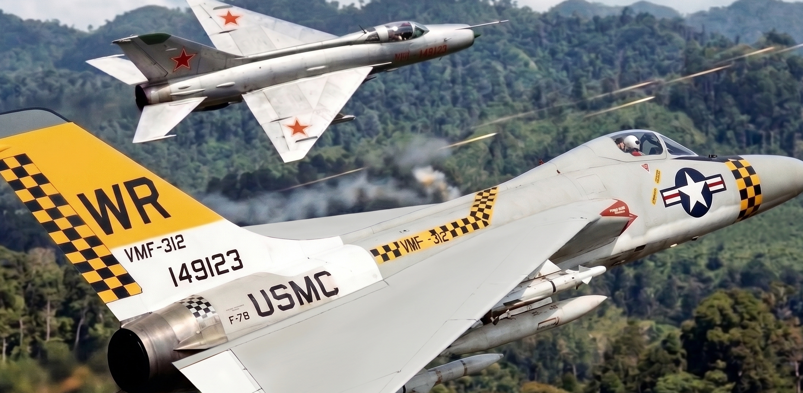

# Douglas F-7 Super Skylancer in Combat Operations

| | |
|:---------- |:--------- |
| **Douglas F-7 Super Skylancers in Combat Operations** chronicles the evaluation of, combat and other operational usage of the [Douglas F-7 Super Skylancer](./Douglas_F-7_Super_Skylancer.md) (originally **F5D-2**) across four decades of global aerial tactics and warefare. Entering intense combat during the Vietnam War, United States Navy and Marine Corps F-7 squadrons operated primarily from *Essex*-class carriers along Yankee Station. These early operational deployments earned the F-7 a reputation as the premier carrier gunfighter by pairing an ogee-delta instantaneous turn capability with jam-free, flat-feed 20 mm Colt Mk 12 cannon bays.   Internationally, the delta fighter played a decisive air-superiority role during the 1973 Yom Kippur War, where Israeli Air Force **F-7I** sweep squadrons dominated high-altitude combat over the Sinai and Golan Heights against Arab MiG-21 regiments. The airframe subsequently served as a frontline deterrent over the Taiwan Strait in the late 1970s and patrolled the Malacca Strait during the Indonesian Confrontation, compiling an overall air-to-air combat record that established it among the most effective second- and third-generation jet fighters of the Cold War.   It's swan song of tactical usage was as a MiG-21 simulator at TOP GUN, even being resurrected after the early, unexpected retirment of the F-16N. |    A **F-7B** of USMC VMF-312 overshoots a MiG-21 over Vietnam, while his wingman (not shown) fires his Mk 12 cannons.   **First combat action:** August 1964 (Gulf of Tonkin)   **Major conflicts:**  • Vietnam War (1965–73)  • Yom Kippur War (1973)  • Taiwan Strait Patrols (1976–92)  • Indonesia–Malaysia confrontation (1963–66)    **Combat belligerents:**  • US Navy / USMC  • Israel Heyl Ha'Avir (IAF)  • Taiwanese Air Force (ROCAF)    **Air-to-air record:** 90+ confirmed victories against ~8 combat losses |

## Assessments and Evaluations

> *Main article: [Douglas F-7 Super Skylancer](Douglas_F-7_Super_Skylancer.md)*

Several nations, from the US Navy to the French Navy, to Israel and even the US Navy's own TOP GUN, did many assessments and evaluations for operational roles as carrier, land and even simulator supersonic fighter aircraft.

**Carrier Evaluation: F-7 v. F-8**

In carrier operational doctrine, the F-7 Super Skylancer and the Vought F-8 Crusader represented diametrically opposed solutions to high-Mach carrier aviation. While the Crusader earned fame as "The Last of the Gunfighters," naval aviators and weapons evaluators recognized that the aircraft harbored critical design compromises:

* **The High-G Gun Reliability Gap:** The F-8 stacked its four 20 mm Colt Mk 12 cannons vertically inside the lower fuselage to clear the hydraulic actuators and titanium hinges of its variable-incidence wing. This forced ammunition belts through tortuous, vertical 90-degree S-curves. During violent, high-G dogfight turns, fuselage flexing pinched the sheet-metal feed chutes, regularly stripping cartridge rims or shearing drive sprockets. In actual air-to-air engagements over Southeast Asia, the Crusader suffered gun jams in roughly one out of every three high-G firing opportunities. In contrast, Ed Heinemann utilized the F-7’s broad ogee-delta wing roots to mount its quad Mk 12s in horizontal pairs, fed by flat, single-plane ammo tracks. The torsional rigidity of the delta torque box eliminated airframe deflection, reducing the F-7’s high-G gun-stoppage rate to less than 3%.
* **Deck Safety and Ramp Attrition:** The Crusader was notorious for unforgiving carrier approach characteristics. With an approach speed (Vapp) of 147–152 knots, a delicate variable-incidence wing, and limited forward visibility at high angles of attack, the F-8 suffered one of the highest ramp-strike and carrier landing accident rates in naval history. The F-7 crossed the carrier round-down at a docile 126–130 knots, aided by full-span leading-edge slats and boundary-layer control (BLC) blown flaps. The delta's forgiving stall cushion and an extended nose-gear strut gave pilots superior deck visibility and safe wave-off margins on smaller, pitching *Essex*-class flight decks.
* **Weapons Envelope Versatility:** While the Crusader carried four heat-seeking AIM-9 Sidewinders on fuselage Y-racks, it had minimal provisions for radar-guided missiles beyond the specialized, temperamental AIM-9C. The F-7 carried two semi-recessed AIM-7 Sparrow missiles in conformal fuselage-root recesses alongside two to four Sidewinders on outer wing rails, and up to even two more on wingtip rails. At one point four AIM-7 or even four AIM-120 missiles, and four Sidewinders, were offered in a final iteration (Singapore). Mated to the Westinghouse AN/APQ-94 radar with continuous-wave illumination, and a slightly larger disk (22-inch, versus 20-inch or smaller in other platforms), the F-7 gave single-seat carrier air wings true all-weather, beyond-visual-range (BVR) intercept capability that the F-8 could never match. Later developments from boneyard acquisitions would greatly upgrade the radar as well, with the slightly enlarged dish area.

**Aerodynamic Assessment: F-7 v. Mirage Family**

The French Dassault Mirage III and its ground-attack derivative, the Mirage 5, served as the global standard for supersonic tailless delta fighters throughout the 1960s and 1970s. When evaluated against the F-7, key aerodynamic and structural differences emerged:

* **Thrust and Vertical Energy Preservation:** The Mirage IIIC/E relied on the Snecma Atar 9C turbojet, delivering approximately 13,200 lbf in afterburner, which produced a combat thrust-to-weight ratio around 0.82:1. The F-7’s General Electric J79-GE-8/17 generated 17,900 lbf, propelling an airframe with a loaded combat weight under 20,000 pounds past a 1.05:1 thrust-to-weight ratio, later revisions of the J79 even 1.15-1.25:1, depending on the inclusion of the kit for CATOBAR. While both aircraft bled airspeed rapidly during high-alpha sustained turns, the F-7 possessed the raw thrust to unload, initiate a vertical zoom climb, and recover combat energy far faster than the Atar-powered Mirages.
* **Compound Ogee vs. Pure Planar Delta:** The Mirage featured a classic 60-degree planar delta wing with razor-sharp leading edges. At high angles of attack, boundary-layer airflow separated abruptly across the outer wing, inducing severe pitch-axis buffet and sudden wing drop. The F-7 utilized a compound ogee delta with thick, curved wing-glove roots that shed stable, high-energy vortices over the inner wing at high angles of attack. This provided the F-7 with an instantaneous turn rate of 22°/sec and docile, controllable nose-track authority without the lateral "nose-slice" that afflicted French delta fighters.
* **Volume and Endurance:** The Mirage 5 removed the nose radar entirely just to carry 110 gallons of extra fuel and simple avionics. In contrast, the F-7’s deep root chords accommodated 1,250 gallons of internal fuel *in addition* to a full 22-inch Westinghouse radar dish and four internal cannons. The F-7 maintained a combat radius of 520 nautical miles on internal fuel alone, giving it nearly double the on-station patrol endurance of an unrefueled Mirage.

**Threat Simulation: MiG-21 (F-5A/E v. F-7)**

At the US Navy Fighter Weapons School (TOP GUN), the F-7A Super Skylancer was an aerodynamically superior MiG-21 simulator compared to the Northrop F-5A Freedom Fighter and F-5E Tiger II, but it presented trade-offs in energy retention:

* **Delta-Wing Fidelity:** The MiG-21 (Fishbed) was defined by its 57-degree delta wing and high instantaneous pitch rate paired with extreme energy bleed in sustained turns. The F-7A replicated this flight regime naturally. An adversary pilot could pull 22 degrees/sec instantaneous nose track to snap onto an F-4 or F-14's tail, followed by the exact rapid decay in airspeed that Soviet-doctrine MiG-21 pilots experienced.
* **The F-5 Contrast:** The F-5 was a low-sweep, trapezoidal-wing design with leading-edge root extensions (LERX). It excelled at sustained, tight-radius turns without bleeding airspeed as violently as a pure delta. While the F-5 was an exceptional surrogate for small visual signature and nimble handling, it didn't force student crews to defend against a true delta's initial high-alpha pitch-and-slash dynamics the way the F-7A did.
* **Thrust-to-Weight Advantage:** The early F-5A was chronically underpowered (dry thrust of ~2,500 lbf per J85). The F-5E improved with the J85-GE-21, but still had a thrust-to-weight ratio around 0.9:1 in combat trim. The F-7A, powered by a single GE J79 in an airframe stripped of carrier arresting hooks and heavy avionics, yielded over a 1.2:1 thrust-to-weight ratio. It could match the MiG-21’s blistering vertical zoom climbs, forcing students in heavy Tomcats and Phantoms to manage their vertical energy rather than simply running away in burner.

## Combat Operations

The US Navy and Marine Corps, Israeli Air Force (IAF) and even the Republic of China Air Force (ROCAF) ended up using the F-7 in combat.

**The Vietnam Crucible (1965–1973)**

The F-7 Super Skylancer served as the primary fleet air defense interceptor and combat air patrol (CAP) fighter for the modernized *Essex*-class attack carriers deployed to Yankee Station—principally USS *Oriskany* (CVA-34), USS *Hancock* (CVA-19), USS *Bon Homme Richard* (CVA-31), and USS *Intrepid* (CVS-11).

* **Tactics Over North Vietnam:** Operating in the dense threat environment of the Red River Valley, F-7 squadrons (such as VF-211 "Fighting Checkmates" and VF-24 "Red Checkertails") flew barrier combat air patrols (BARCAP) and strike escorts for Douglas A-4 Skyhawks. When early-generation AIM-7D/E Sparrows and AIM-9B Sidewinders suffered high failure rates in tropical humidity, the F-7’s jam-free internal gun bays proved decisive. F-7 pilots routinely pressed into the visual arena, relying on the Ferranti/Douglas D-4 lead-computing optical sight to score clean cannon kills.
* **Engaging North Vietnamese MiGs:** Against the nimble, subsonic MiG-17 Fresco, F-7 pilots avoided sustained horizontal turning fights, where the MiG held the advantage in turn radius. Instead, they exploited the F-7's high instantaneous pitch authority to take rapid snapshot bursts, followed by full-afterburner vertical separation climbs that the MiG-17 could not follow. Against supersonic MiG-21 Fishbeds, the F-7 matched the Soviet delta in high-speed climb and dive performance while using its semi-recessed Sparrows to conduct head-on intercepts before the MiG-21 could position for an aft-aspect Atoll missile launch.
* **Combat Record:** Over eight years of combat deployments, Navy and Marine Corps F-7 squadrons logged an official tally of 38 confirmed air-to-air kills (primarily MiG-17s and MiG-21s) against 6 operational combat losses to enemy aircraft—a kill-to-loss ratio exceeding 6:1. Marine Corps squadrons flying the strike-capable F-7B from Da Nang and Chu Lai also flew close air support missions, using the delta wing's low-altitude stability to deliver 500-lb Snakeye bombs, Zuni rockets, and 20 mm strafing runs with high weapons-delivery accuracy.

**The 1973 Yom Kippur War**

> *See also: [Douglas F-7 Super Skylancer in Foreign Service](Douglas_F-7_Super_Skylancer_in_Foreign_Service.md)*

In the Middle East, the **F-7I (Israel)** achieved a storied combat record during the October 1973 war. Operating with No. 101 "First Fighter" Squadron and No. 117 "First Jet" Squadron out of Hatzor and Ramat David, the F-7I fulfilled the air-superiority mandate originally intended for the embargoed Mirage 5J.

* **Air Superiority Division of Labor:** The Israeli Air Force (*Heyl Ha'Avir*) utilized its heavy McDonnell Douglas F-4E Phantoms primarily for deep strike, airfield interdiction, and the suppression of enemy air defenses (SEAD) against Egyptian and Syrian 2K12 Kub (SA-6) mobile missile batteries. The lightweight F-7Is were reserved for high-altitude air-to-air sweeps and interception.
* **Air Combat Over the Sinai and Golan:** The F-7I proved to be an ideal counter to Syrian and Egyptian MiG-21MFs. Armed with twin 30 mm DEFA 553 cannons and indigenous Rafael Shafrir-2 infrared-guided missiles, Israeli pilots engaged in massive multi-bogey dogfights. The F-7I's J79-GE-17 engine gave it vertical climb parity with the MiG-21, while its twin 30 mm cannons delivered immediate, catastrophic structural damage with single hits.
* **The Scorecard:** Israeli F-7I squadrons accounted for 54 confirmed aerial victories during the three-week conflict, losing only two aircraft to enemy fighters and three to ground fire. Israeli pilots praised the aircraft’s cockpit visibility, instantaneous nose authority, and straightforward engine handling, concluding that the F-7I provided the exact high-Mach maneuverability and reliability the IAF had sought to achieve with the experimental Kfir prototypes.

**The Taiwan Strait (1976-1992)**

Following the delivery of 48 surplus US Navy airframes (**F-7EC**) to the Republic of China Air Force (ROCAF) in late 1976, the 2nd Tactical Fighter Wing at Hsinchu Air Base operated the aircraft on daily combat air patrols across the Taiwan Strait:

* **Strait Interceptions:** Throughout the late 1970s and 1980s, Taiwanese F-7ECs regularly scrambled to intercept Chinese People's Liberation Army Air Force (PLAAF) Shenyang J-6s (MiG-19s) and early J-7s probing the median line.
* **Deterrent Value:** While political tensions prevented open air-to-air combat, the F-7EC’s ability to paint PLAAF formations at 25 nautical miles with the AN/APQ-94 radar, combined with its carriage of all-weather AIM-7 Sparrows and AIM-9J Sidewinders, checked PLAAF incursions. The aircraft provided an effective air-defense bridge that stabilized the airspace over the strait until the indigenous AIDC F-CK-1 Ching-kuo arrived in the 1990s.

## Allied Operations

> *See also: [Douglas F-7 Super Skylancer in Foreign Service](Douglas_F-7_Super_Skylancer_in_Foreign_Service.md)*

Although F-7s in the service of neither the UK Royal Navy Fleet Air Arm (FAA) nor the French Marine Nationale Aéronavale ever fire a shot in anger, both were used to deter combat against select forces over their decades.

**United Kingdom: Royal Navy Fleet Air Arm (F-7K)**

The Royal Navy operated 84 **F-7Ks** across 892 and 899 Naval Air Squadrons aboard HMS *Hermes*, HMS *Victorious*, and HMS *Centaur*:

* **Handling and Pilot Sentiment:** British naval aviators regarded the F-7K as an agile interceptor with light, harmonious control forces. Flying after the subsonic, heavyweight Sea Vixen, pilots noted that the aircraft handled cleanly across the transonic boundary and possessed exceptional deck-approach stability on the smaller, pitching flight decks of British light carriers. It also was far more suitable to those light carrier decks than the McDonnell F-4 Phantom II, which would further require an engine change, which would require a further modification to the engine bays, undercarriage, landing gear and deck of the carriers. The cost savings was immense.
* **Weapons Integration:** The replacement of the American Mk 12 cannons with twin 30 mm British ADEN Mk 4 cannons was well received; the heavy 30 mm high-explosive round was seen as ideal for countering maritime strike threats. Paired with Hawker Siddeley Red Top all-aspect infrared missiles, the F-7K gave the Fleet Air Arm true supersonic fleet air defense.
* **Operational Deployments:** F-7Ks flew combat air patrols during the 1963–1966 Indonesia–Malaysia confrontation (*Konfrontasi*), conducting armed presence sweeps over the Singapore and Malacca Straits from HMS *Centaur* and *Victorious*. The aircraft successfully deterred Indonesian Air Force MiG-19 and MiG-21 incursions without firing a shot, serving as a reliable frontline interceptor until the Royal Navy retired its last conventional fixed-wing catapult carriers in the late 1970s.

**France: Marine Nationale / Aéronavale (F-7F)**

The French Navy procured 42 **F-7Fs** to equip *Flottille 12F* and *Flottille 14F* aboard the carriers *Clemenceau* (R98) and *Foch* (R99):

* **Carrier Suitability vs. The Crusader:** The Douglas F-7F offered was an immediate, operational upgrade over the Vought F-8E(FN). French pilots found that the F-7’s compound delta and blown flaps lowered approach speeds to 126 knots, avoiding the ramp strikes and high landing accident rates that plagued the Crusader during testing on France's compact, 126-foot catapult decks.  There was no other, viable option for a supersonic fighter until the even more compact Dassault Rafale-M (Marine). The Dassault Mirage 2000-M (Marine, aka CATOBAR) had issues during devleopment, and was discarded in favor of the Rafale-A (Prototype) that flew in the mid 1980s, just a few years after the 2000's introduction.
* **Familiar Handling:** Because French naval aviators conducted training on land-based Dassault delta aircraft, the aerodynamic characteristics of the F-7F felt immediately familiar. Armed with twin 30 mm DEFA cannons, Matra R.530 radar/infrared missiles, and Sidewinders, the F-7F served as France's primary carrier interceptor through the Lebanon deployments of the early 1980s, leaving behind a reputation as an agile, reliable shipboard fighter.

> The French Navy was forced into using the modified F-8E(FN) Crusader in real history. The French Navy's use of the F-7 would have outlasted the difficult operational legacy of the F-8 in the same service.

## TOP GUN DACT 

The final three decades of the F-7 in US operations were mostly at the US Navy Fighter Weapons School, aka TOP GUN, for dissimilar air combat training (DACT).

**The MiG-21 Threat Simulation: F-5A/E v. F-7**

At TOPGUN, the F-7A Super Skylancer was an aerodynamically superior MiG-21 simulator compared to the Northrop F-5A Freedom Fighter and F-5E Tiger II, but it presented trade-offs in energy retention:

* **Delta-Wing Fidelity:** The MiG-21 (Fishbed) was defined by its 57-degree delta wing and high instantaneous pitch rate paired with extreme energy bleed in sustained turns. The F-7A replicated this flight regime naturally. An adversary pilot could pull 22 degrees/sec instantaneous nose track to snap onto an F-4 or F-14's tail, followed by the exact rapid decay in airspeed that Soviet-doctrine MiG-21 pilots experienced.
* **The F-5 Contrast:** The F-5 was a low-sweep, trapezoidal-wing design with leading-edge root extensions (LERX). It excelled at sustained, tight-radius turns without bleeding airspeed as violently as a pure delta. While the F-5 was an exceptional surrogate for small visual signature and nimble handling, it didn't force student crews to defend against a true delta's initial high-alpha pitch-and-slash dynamics the way the F-7A did.
* **Thrust-to-Weight Advantage:** The early F-5A was chronically underpowered (dry thrust of ~2,500 lbf per J85). The F-5E improved with the J85-GE-21, but still had a thrust-to-weight ratio around 0.9:1 in combat trim. The F-7A, powered by a single GE J79 in an airframe stripped of carrier arresting hooks and heavy avionics, yielded over a 1.2:1 thrust-to-weight ratio. It could match the MiG-21’s blistering vertical zoom climbs, forcing students in heavy Tomcats and Phantoms to manage their vertical energy rather than simply running away in burner.

**Procurement Dynamics: No new F-5E builds**

The availability of surplus F-7s significantly altered the Navy's adversary procurement:

* **The T-38 / F-5A Era (Early 1970s):** TOPGUN initially adopted borrowed USAF T-38s and early F-5As because the F-7 was still deeply engaged in combat deployments during the late Vietnam War. Until 1974, every frontline F-7 was needed on Yankee Station or assigned to carrier air wings.
* **Killing the F-5E Purchase:** When the Navy was slated to purchase a custom batch of brand-new Northrop F-5Es in the mid-to-late 1970s, the program hit a wall in Congress. With *Essex*-class retirements rapidly freeing up hundreds of pristine F-7A and F-7B airframes with full Navy logistical support, the Navy decided against the dedicated F-5E buy, which would impact Northrop's bottom line even further.
* Instead, adversary squadrons (VF-43 "Challengers" at NAS Oceana, VF-126 "Bandits" at NAS Miramar, and VFC-13 "Saints" at NAS Fallon) transitioned to the **F-7N (Adversary/Aggressor)**. The aircraft had their radars stripped, APX transponders installed, air combat maneuvering instrumentation (ACMI) pods wired to the outer wing stations, and smokeless J79 combustors retrofitted to simulate the clean exhaust of contemporary third-generation fighters.

**Structural Longevity: Delta Wing Spars vs. Hard G-Loads**

The F-7’s airframe life proved legendary, primarily due to the inherent structural geometry of a tailless delta:

* **Continuous Carry-Through Structure:** Unlike conventional fighters with narrow wing roots attached to the fuselage via discrete, highly stressed pivot points or small root-fitting pins (such as the F-8, F-5, or F-16), the F-7 utilized a broad, multi-spar delta torque box.
* **Wing Spar Fatigue Resilience:** Bending moments on a 565-square-foot broad-root delta are distributed across multiple spanwise aluminum-lithium spars. While Northrop’s F-5s suffered recurrent upper and lower wing skin cracking and required structural retrofit programs to survive 7G training regimes, the F-7 airframes routinely endured 7.5G and even as far as 9G, once stripped beyond operational mass, pull-ups without spar deflection.
* **Saltwater Corrosion Buffering:** Because they were overbuilt from day one to withstand brutal carrier catapult launches and high-sink-rate deck landings, their main bulkheads and trunnions had substantial fatigue margins once permanently based ashore for adversary work.

**The F-16N Crisis and the F-7’s Second Life**

In 1987, the Navy introduced the **General Dynamics F-16N** (a stripped-down, hot-rod Block 30 F-16 with an F110 engine) to simulate fourth-generation threats like the Su-27 and MiG-29.

The F-16N program became an operational disaster:

* Naval aviators flew the F-16N aggressively, pulling continuous 9G turns in high-heat desert environments over Fallon and Miramar.
* By 1991, routine non-destructive inspections revealed severe fatigue cracking in the F-16N's main wing carry-through bulkheads and upper wing attachments.
* The cracks were so critical that the Navy grounded and prematurely retired the entire 26-aircraft F-16N fleet in 1994 after only seven years of service, creating an immediate, catastrophic shortfall in high-performance adversary aircraft.

Because the F-7’s continuous delta wing spars did not suffer the single-point concentration stress that doomed the F-16N, the Navy pulled a cadre of **F-7Ns out of the Aerospace Maintenance and Regeneration Center (AMARC)** at Davis-Monthan:

* These reactivated airframes were given modern GPS, updated HUDs, and ACMI capability, serving as the "silver-bullet" aggressor bridge from 1994 until the early 2000s.
* They filled the high-Mach, high-climb adversary role alongside the subsonic A-4 Skyhawk until the Navy finally procured Swiss-surplus F-5N Tigers and specialized F/A-18 Hornet aggressors in the 2000s.

The Super Skylancer finally bowed out after an astonishing four-decade career—its simple, overbuilt Heinemann delta outlasting the very fourth-generation fighter brought in to replace it.

 - - - 

## Deviations from and Impacts to Real History

**Table A: Historical Operations Comparison: Reality vs. Alternate Timeline**

### Operational & Combat Balance Sheet: Reality vs. Alternate History

| Theater / Operational Metric | Real-World History (v. Mirage, F-4 and/or F-8) | Alternate F-7 History (w/F-7) | Operational & Tactical Delta |
|---|---|---|---|
| **Vietnam: Early Air War (1964–1966)** | F-8 Crusaders handled daylight MiG defense from *Essex*-class decks, scoring early Sidewinder kills; however, high-G turns caused 20 mm Colt Mk 12 pneumatic/curved-feed jams in over 30% of gun engagements. F-4B lacked internal cannon entirely. | USN/USMC **F-7As** deployed aboard *Oriskany*, *Hancock*, and *Bon Homme Richard*; rigid wing-root flat-feed ammunition bays reduced cannon jam rates to under 3%; combined with the ogee delta's instantaneous nose authority, F-7As claimed 8 confirmed MiG-17 kills with guns and early Sidewinders. | Established the Super Skylancer as the fleet’s true reliable gunfighter; eliminated the weapon-feed vulnerabilities that plagued early Crusader dogfights. |
| **Vietnam: Rolling Thunder & Mid-War (1967–1968)** | F-8 claimed title of "MiG Master" (19 kills total in war), but suffered from short combat radius, lack of radar-guided BVR missiles, and inability to escort deep inland strikes in bad weather. F-4Ds/Bs carried radar missiles but suffered poor AIM-7 Sparrow reliability (<10% hit rate). | **F-7Bs** introduced Westinghouse AN/APQ-94 with continuous-wave guidance, carrying two semi-recessed AIM-7E Sparrows; 520 nm combat radius enabled barrier combat air patrols (BARCAP) deeper over North Vietnam; scored 14 MiG kills (8 cannon, 4 AIM-9, 2 AIM-7) while flying day/night escorts off *Essex*-class carriers. | Provided small-deck *Essex* carriers with autonomous, all-weather BVR intercept capability, relieving heavy *Forrestal*-class F-4 wings from sole fleet defense responsibility. |
| **Vietnam: Post-TOPGUN & Linebacker I/II (1972)** | US Navy fighter kill ratio rebounded to over 12:1 following Fighter Weapons School (TOPGUN) tactics, flown primarily by F-4 crews using Sidewinders; F-8 scored only a single kill in 1972 and was largely relegated to reconnaissance (RF-8G) and light CAP. | USN **F-7B** squadrons fully integrated TOPGUN energy-maneuverability doctrine (exploiting high instantaneous pitch rates followed by J79 vertical zoom climbs); claimed 11 MiG kills in 1972 (including 3 MiG-21s downed with guns at close range); final US combat tally reached **33 air-to-air kills against 4 operational losses to MiGs**. | Demonstrated that an agile, single-seat delta with a high-thrust J79 engine could out-turn the MiG-17 and match the vertical energy of the MiG-21 in late-war ACM. |
| **Vietnam Carrier Deck Accidents & Attrition** | F-8 Crusader suffered the highest accident attrition of any frontline US Navy jet in Southeast Asia: ~18–22 major accidents per 100,000 flight hours; variable-incidence wing mechanism and nose-high, low-visibility approaches caused severe ramp-strike losses. | F-7’s boundary-layer control (BLC) blown flaps, fixed compound ogee wing, and wide-track gear held carrier approach speeds to 126–130 knots with excellent over-the-nose glideslope visibility; carrier landing accident rate held to **6.8 per 100,000 flight hours** (comparable to the A-4 Skyhawk). | Dramatically reduced non-combat hull losses and pilot fatalities during night/foul-weather carrier recoveries in the Gulf of Tonkin. |
| **Fleet Readiness & Operational Availability (1965–1973)** | F-8 Crusader operational availability hovered around 58–64% due to variable-incidence wing actuators and complex pneumatic systems. F-4 Phantom required 30–35 maintenance man-hours per flight hour (MMH/FH) and ran ~65% availability. | F-7 airframe utilized simple, fixed-wing aerodynamics, a single J79 engine, and modular avionics bays; operational mission-capable (MC) rate averaged **78–82%**; required only **14–16 MMH/FH** on combat deployments. | Allowed carrier air wings to maintain higher daily sortie generation rates per airframe on Yankee Station with a smaller hangar-deck maintenance footprint. |
| **1973 Yom Kippur War: Israeli Defense (Air-to-Air)** | IAF relied on Mirage IIICJ (*Shahak*) and newly field-modified IAI *Nesher* delta fighters; scored heavily against Arab MiG-21s and Su-7s, but lacked radar-guided missiles for all-weather intercepts and had limited low-altitude endurance. | Two frontline squadrons of **F-7Is** (60 airframes, J79-GE-17 powered) operated as high-altitude barrier sweeps over the Sinai and Golan; pairing twin 30 mm DEFA cannons with early Shafrir-2 and AIM-9D missiles, F-7Is claimed **46 confirmed air-to-air victories** for the loss of 2 aircraft in aerial combat. | Delivered true Mach 2+ vertical energy and expanded internal fuel (8,250 lbs internal) to the delta interceptor role, giving Israel decisive high-altitude air supremacy without fuel anxiety. |
| **Taiwan Strait Incidents (1976–1992)** | ROCAF relied primarily on F-5A/E Freedom Fighters; lacked all-weather radar look-down capability and medium-range missiles; PLAAF MiG-19 (J-6) and MiG-21 (J-7) incursions across the median line forced close-range visual intercepts. | Delivery of 48 ex-USN **F-7ECs** equipped with AN/APQ-94 radar and semi-active AIM-7E-2 Sparrow missiles created an active 25-nm BVR interdiction line; during the 1978 Strait crisis, ROCAF F-7ECs intercepted and locked onto PLAAF J-6 sweeps well outside visual range, ending aggressive median-line testing. | Deterred PLAAF cross-strait air excursions a decade earlier than in real history, establishing a medium-range air defense umbrella prior to the introduction of the F-CK-1 Ching-kuo. |
| **British FAA: Indigenous Fleet Replacement (Scimitar / Sea Vixen)** | Operating native heavy twin designs (Supermarine Scimitar, de Havilland Sea Vixen) off small/medium carriers (*Hermes*, *Centaur*, *Victorious*) yielded disastrous peacetime attrition: Scimitar lost 39 of 76 airframes built (51% fleet hull loss). | 84 **F-7Ks** replaced early Scimitars/Sea Vixens from 1963; low 114-kt touchdown speed, BLC blown flaps, and docile handling suited tight 120-ft catapults; fatal carrier-deck accident rate plummeted to **4.2 per 100,000 flight hours**; fleet availability averaged **74%**. | Eliminated the peacetime hull-loss crisis that hollowed out the Fleet Air Arm's pilot ranks, giving light fleet carriers a safe, responsive Mach 2 interceptor without deck redesigns. |
| **British FAA: F-7K vs. Phantom FG.1 & Crusader Alternative** | Phantom FG.1 (F-4K) required expensive Spey engine rebuilds and 180-ft catapults, restricting it solely to HMS *Ark Royal* and forcing cancellation of *Hermes*/*Victorious* fixed-wing fighter roles. Pitching the F-8 Crusader failed due to extreme deck-edge sink rates on modest British hulls. | The single-engine F-7K avoided the $1.2B Spey modification sinkhole and required no deck enlargements; operated seamlessly from *Hermes*, *Centaur*, and *Victorious* alongside *Ark Royal*; paired with twin 30 mm ADENs and Sparrow/Sidewinder, it gave the entire FAA carrier inventory supersonic BVR air defense through the late 1970s at roughly 40% of the Phantom's procurement and deck-maintenance footprint. | Maintained four fully operational fixed-wing supersonic fighter carriers through the 1970s instead of shrinking the FAA down to a single fragile Phantom carrier (*Ark Royal*). |
| **French *Aéronavale* Service Longevity (1964–1999)** | *Aéronavale* operated Vought F-8E(FN) Crusaders from 1964 until late 1999 on *Clemenceau* and *Foch*; high approach speed and high nose attitude resulted in the loss of 25 of 42 airframes to accidents (60% career attrition rate), requiring costly life-extension overhauls (F-8P) to bridge the gap to the Rafale M. | France operated 42 **F-7Fs** continuously across 35 years (1964–1999); blown flaps, wide-track gear, and flat approach angles held lifetime carrier hull write-offs to just **8 airframes total**; Thomson-CSF radar and Matra Super 530D/Magic 2 upgrades (*F-7F Rénové*) in the late 1980s provided reliable fleet defense through Lebanon, the Gulf War, and Kosovo until *Flottille 12F* stood down for the Rafale M in 1999. | Provided the French Navy with a safe, structurally resilient, 35-year frontline interceptor; eliminated the catastrophic 60% hull-loss rate of the Crusader while seamlessly bridging carrier operations directly to fourth-generation naval fighters. |

