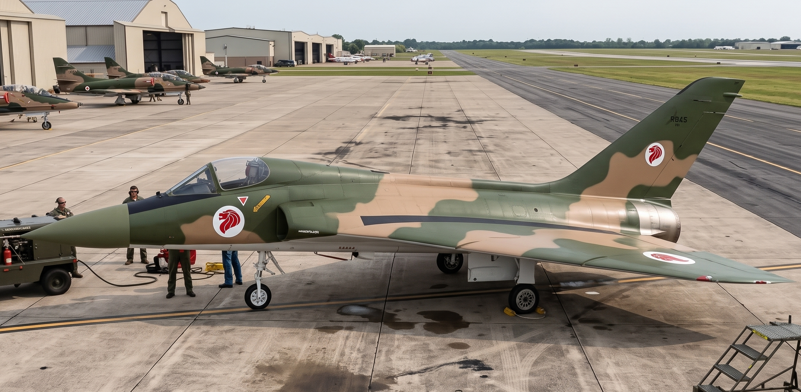

# Douglas F-7 Super Skylancer in Foreign Service

| | |
|:---------- |:--------- |
| The **Douglas F-7 Super Skylancer in Foreign Service** encompasses the global procurement, operational deployment, and extensive aftermarket upgrade programs of the **[Douglas F-7 Super Skylancer](Douglas_F-7_Super_Skylancer.md)** single engine carrier fighter by international air arms.  First exported in the 1960s as factory new-builds to the British Royal Navy (**F-7K**), French *Aéronavale* (**F-7F**), and Israeli Air Force (**F-7I**), the type bypassed early continental sales hurdles to establish a formidable international footprint.  Despite glowing pilot evaluations for the European/Export variant (**F5D-2E**, later designated the **F-7E**) against all competition, Lockheed swept the board in 1959–1960, securing the "Deal of the Century" across West Germany, the Netherlands, Belgium, and Italy. The deciding factor was not aerodynamic merit, but the covert corporate apparatus that exploded into global headlines during the [1975–1976 Church Committee Senate hearings](https://en.wikipedia.org/wiki/Lockheed_bribery_scandals).   During the late 1970s and early 1980s, the decommissioning of US Navy [modernized Essex-class attack carriers](https://en.wikipedia.org/wiki/Essex-class_aircraft_carrier#Post-war_rebuilds) released hundreds of low-hour airframes into secondary markets, leading to frontline adoption by Taiwan (**F-7EC**) and South Korea (**F-7EK**), with both Greece and Turkey receiving advanced refit models from McDonnell-Douglas (**F-7C Advanced Skylancer**) as an interim during F-16 order backlogs.  The pinnacle of foreign operation occurred in Singapore, where ST Aerospace thoroughly modernized **F-7S** (original F-7A) airframes into the **F-7SU Super Skylancer II**. The **F-7SU** was a deep upgrade that integrated the [General Electric F404-GE-402 turbofan](https://en.wikipedia.org/wiki/General_Electric_F404#Specifications_(F404-GE-402)) to match the more invasive [A-4SU Super Skyhawk upgrade program](https://en.wikipedia.org/wiki/ST_Aerospace_A-4SU_Super_Skyhawk), also adding pulse-Doppler radar, and glass cockpit avionics, sustaining frontline service into the early 2010s. |    RSAF **F-7SU** (foreground) on tarmac with multiple [A-4SU](https://en.wikipedia.org/wiki/ST_Aerospace_A-4SU_Super_Skyhawk) aircaft (background left)   **Type:** Multirole fighter / interceptor **Manufacturers:** • Douglas Aircraft Company • Singapore Technologies Aerospace  **First export delivery:** 1963 (Royal Navy F-7K) **Final retirement:** 2012 (RSAF F-7SU)  **Primary foreign users:** • Royal Navy (Fleet Air Arm) • *Aéronavale* (*Marine Nationale*) • Israeli Air Force • Republic of Singapore Air Force • Republic of Korea Air Force  **Total foreign operated:** 368 airframes (186 new-build) **Developed from:** [Douglas F-7](Douglas_F-7_Super_Skylancer.md) |

## Background

> *Main article: [Douglas F-7 Super Skylancer](Douglas_F-7_Super_Skylancer.md)*

To appeal directly to non-US Navy operators, Douglas Aircraft Company replaced the four US Navy 20 mm Colt Mk 12 cannons with **twin 30 mm DEFA 552 or ADEN Mk 4 revolver cannons** firing the standard NATO 30×113mmB cartridge. The installation was structurally straightforward, capitalizing on Ed Heinemann’s modular, flat-feed wing-root bays. The resulting weapons package delivered a combined 2,600 rounds per minute of hard-hitting high-explosive shells, integrated alongside semi-recessed AIM-7 Sparrow radar-guided missiles and outer-wing and wingtip AIM-9 Sidewinder rails.

To further appeal to land-only operators, Douglas offered a generic **F5D-2E (European/Export)** model, later (1962) and hereafter referred to as the **F-7E**, which could be further tailored for specific operators. By stripping the airframe of its heavy catapult bridle hooks, salt-water barrier coatings, reinforced carrier arresting trunnions, and beefed-up oleo landing gear struts, Douglas engineers shed roughly 1,500 pounds of dead structural weight. With an empty weight dropping to ~13,600 pounds, the single General Electric J79-GE-8 engine yielded a combat thrust-to-weight ratio of 1.01:1 (surpassing 1.25:1 at low-fuel intercept dash weights).

## Operators: CATOBAR

Although land-based exports were the focus and priority, Douglas still had its greatest success with eager, naval partners across the pond.

**Blue-Water Ally: The Royal Navy’s F-7K (1962–1976)**

In the early 1960s, the British Royal Navy faced an existential carrier aviation crisis. Fleet Air Arm catapults and flight decks on older, smaller carriers—specifically HMS *Hermes*, HMS *Victorious*, and HMS *Centaur*—were physically incapable of launching and recovering the massive, 55,000-pound McDonnell F-4 Phantom II. Even on the larger HMS *Ark Royal* and HMS *Eagle*, operating the American Phantom required a ruinously expensive redesign to shoehorn in the wider Rolls-Royce Spey turbofan alongside complex deck modifications that the HM Treasury actively sought to cancel.

Douglas stepped into the breach with the **F-7K (Kingdom)**, an off-the-shelf carrier interceptor tailored for small British flight decks. Retaining the standard J79-GE-8 turbojet, the F-7K weighed under 24,000 pounds loaded and comfortably cleared the modest BS-4 and BS-5 steam catapults. The aircraft was customized for Fleet Air Arm service with twin 30 mm British ADEN cannons in place of the Mk 12s, British Ferranti radar-ranging software interfaces, and wiring for de Havilland Firestreak and Red Top air-to-air missiles alongside standard Sidewinders. 

The Royal Navy procured 84 F-7K airframes between 1963 and 1967, assigning them to 892 and 899 Naval Air Squadrons. The aircraft operated with exceptional reliability, providing the Fleet Air Arm with true Mach 2+ all-weather fleet air defense without requiring expensive catapult overhauls. Operating alongside Blackburn Buccaneers and de Havilland Sea Vixens, the F-7K preserved British fixed-wing carrier aviation through the austere defense cuts of the early 1970s, flying continuously until the final conventional strike carrier, HMS *Ark Royal*, was paid off in the late 1970s.

The operational success of the F-7K across British carrier decks drew intense interest from the Royal Australian Navy (RAN), which conducted extensive trials and carrier suitability evaluations in 1964–1965 to find a supersonic successor to the de Havilland Sea Venom for HMAS *Melbourne* (R21). Australian test pilots praised the Super Skylancer’s forgiving low-speed handling, docility around the round-down, and the unmatched punch of its twin 30 mm ADEN cannons. However, the evaluation board was forced to conclude that the aircraft was simply beyond the physical thresholds of Australia’s lone, modified *Majestic*-class light carrier.

*Melbourne*’s short 500-foot flight deck, modest BS-4 steam catapult, and arrestor cable energy limits would have restricted the F-7K to severely penalized fuel and weapons payloads during tropical catapult launches. Confronted with the fiscal impossibility of procuring a larger carrier, Canberra reluctantly passed on the Super Skylancer and instead acquired the Douglas A-4 Skyhawk in 1967. Crucially, the Australian acquisition borrowed heavily from the F-7K program: the specialized wiring looms, telemetry suites, and missile-rail interfaces engineered for the Commonwealth Super Skylancers were directly ported over to produce the customized A-4G, giving the RAN an agile, Sidewinder-capable fleet defender that operated within *Melbourne*’s tight deck confines until the early 1980s.

**Gallic Carrier Fighter: The *Aéronavale*’s F-7F (1964–1999)**

In the early 1960s, the French Navy (*Marine Nationale*) faced a severe carrier air defense shortfall. The newly commissioned attack carriers *Clemenceau* (R98) and *Foch* (R99) displaced only 22,000 tons standard and featured modest 126-foot BS-5 steam catapults. The indigenous maritime fighter project, the Dassault Étendard IVM, was strictly a transonic strike aircraft lacking radar-guided missile capability. Marcel Dassault's attempts to navalize the delta-wing Mirage III (the Mirage IIIM) collapsed due to brutal landing sink rates and an unacceptably high 155-knot carrier approach speed. Faced with an immediate requirement for an all-weather interceptor, Paris turned to Washington, ultimately procuring 42 new-build **Douglas F-7F** airframes between 1964 and 1966 to equip *Flottille 12F* and *Flottille 14F*.

> Unlike the modified Vought F-8E(FN) Crusader adopted in real-world history—which was plagued by a terrifying carrier ramp-strike accident rate on the short French flight decks ...

The F-7F proved an immediate aerodynamic triumph. With boundary-layer control (BLC) blown flaps, an extended nose strut providing a clear glideslope view, and a forgiving 126-knot approach speed, the Super Skylancer operated safely in heavy Mediterranean and North Atlantic seas. Customized specifically for French naval doctrine, the F-7F replaced the US Navy's quad 20 mm cannons with twin 30 mm DEFA 552 revolver cannons and integrated French Thomson-CSF Cyrano datalink systems. For fleet air defense, French crews paired outer-wing Sidewinders with the semi-active radar-homing Matra R.530 missile carried on a specialized centerline pylon, establishing an agile supersonic air defense umbrella across the Mediterranean and during deployments off Djibouti.

By late 1967, following the corporate merger creating the McDonnell Douglas Corporation (MDC), American engineers partnered with French missile manufacturer Nord-Aviation (later integrated into Aérospatiale) to present an ambitious modernization pitch: certifying the F-7F to carry the forthcoming **AM39 Exocet** anti-ship missile. Under the MDC proposal, the rigid continuous-spar wing of the F-7F would be wired to carry an Exocet under each inboard wing station alongside an upgraded Thomson-CSF radar, converting the *Aéronavale*’s interceptor force into a devastating supersonic maritime strike platform with true stand-off anti-ship capability. 

However, French industrial protectionism quickly doomed the initiative. Marcel Dassault and Gaullist defense officials vehemently refused to permit an American-built airframe to monopolize French maritime strike. Dassault successfully lobbied the Ministry of Defence to kill the F-7F Exocet integration, falsely promoting the prospective **Super Étendard** as a "low-cost, low-risk upgrade" derived directly from the existing Étendard IVM tooling with purported 90% commonality. In reality, the Super Étendard required an almost entirely new airframe, cost taxpayers significantly more than projected, and saddled the French Navy with an underpowered, subsonic strike aircraft instead of an off-the-shelf, supersonic, radar-equipped strike delta.

The F-7F was relegated strictly to fleet air defense, serving with high reliability until its formal retirement in 1999, with the deployment of the first Dassault Rafale Marine (Rafale-M) squadrons.

## Operators: Land-based

Starting in 1958 and until the merger with McDonnell in 1967, Douglas pitched the de-navalized **F5D-2E/F-7E (European/Export)** Skylancer across Western Europe and East Asia as the ultimate single-engine tactical interceptor. Stripping the catapult hooks and carrier gear, leveraging its boundary-layer control (BLC) blown flaps on its massive 565-square-foot wing, with its extraordianary 110-knows touchdown speed.  Sadly, its sole, major land-based operator sale was in the Middle East, a region of little opportunity given shifts in US policy in the 1960s.

**The Middle Eastern Crucible: Israel and the J79 Delta (1967–1979)**

The geopolitical earthquake of the 1967 Six-Day War radically reshaped Douglas's Middle Eastern export prospects. When French President Charles de Gaulle imposed a total arms embargo on Israel—halting the delivery of 50 prepaid Dassault Mirage 5J interceptors—the Israeli Air Force (*Heyl Ha'Avir*) was left with an aging fighter force and a looming quantitative deficit against Soviet-supplied Egyptian and Syrian MiG-21s.

> In the real, historical timeline, this embargo forced Israel into an elaborate industrial espionage campaign to build the Nesher and spend millions experimentally marrying the General Electric J79 engine to the Mirage airframe to create the IAI Kfir.

With the F-7 line active and proven, the Pentagon provided an immediate off-the-shelf solution. As part of the post-1967 diplomatic pivot solidifying the US as Israel’s primary military backer, Washington authorized the sale of **60 new-build F-7I (Israel) Super Skylancers** alongside the first tranches of F-4E Phantoms under the *Peace Patch* framework. The F-7I delivered the exact configuration the IAF desired: an agile, low-wing-loading delta airframe powered by an American J79-GE-17 engine, fitted with twin 30 mm DEFA 553 cannons, and plumbed for indigenous Shafrir-2 (and later Python-3) infrared missiles.

Entering frontline service in 1968, the F-7I played a decisive combat role during the 1973 Yom Kippur War. Operating from bases in the Negev and Sinai, F-7I squadrons acted as primary high-altitude air-to-air sweep dogfighters. While the heavier, twin-engine F-4E Phantoms were tasked with the brutal work of low-altitude SEAD strikes against Syrian and Egyptian 2K12 Kub (SA-6) surface-to-air missile belts, the agile F-7Is took on the air superiority role. The F-7I's combination of 22°/sec instantaneous pitch authority, 30 mm heavy cannons, and high vertical climb rate produced a staggering kill-to-loss ratio against Arab MiG-17s and MiG-21s, fully satisfying the requirement that had historically birthed the IAI Kfir.

## Failed Bids

Achieving a landing roll under 2,500 feet, safe highway-strip dispersal, and unrefueled endurance that left competing American and European platforms far behind, NATO and other, operational test pilots consistently graded the Douglas **F-7E** as the most forgiving and lethal combat aircraft evaluated. Douglas also offered to retrofitted the tailcone with a heavy-duty braking parachute, for short, rain-slicked NATO runways and dispersed highway landing strips where even shorter was required. Yet, country by country, technical merit was systematically bypassed by sovereign industrial mandates and unprecedented corporate corruption.

**The European Showdown and Lockheed Bribery Scandal (1958–1961)**

The Douglas F-7E land-based Super Skylancer was formally evaluated in West Germany, Switzerland, Japan and others, against the following competitors.

* Lockheed: Pitching the heavily modified, all-weather F-104G Starfighter

* Dassault: Offering the Mirage IIIA/C

* Grumman: Pitching the F11F-1F Super Tiger (also powered by the J79)

* English Electric: Offering the Lightning

Operational test pilots—most notably the *Luftwaffe* evaluation team led by WWII aces Günther Rall and Johannes Steinhoff, alongside Swiss Alpine evaluation cadres—praised the Douglas delta. The F-7E offered double the internal fuel capacity of the Super Tiger and avoided the lethal, high-speed approach regimes and pitch-up tendencies of the Starfighter. However, the aircraft collided directly with the Lockheed overseas bribery network. Slush funds funneled to West German Defense Minister Franz Josef Strauss and Prince Bernhard of the Netherlands locked the F-104 into NATO consortium production, while Gaullist industrial policy legally mandated that the French Air Force procure Marcel Dassault’s Mirage III.

Despite unanimous technical praise from military test cadres, the new-build **F-7E**, then **F5D-2E**, was completely shut out of continental European land-based air forces.

**West Germany (*Luftwaffe*)**

In early 1958, the *Luftwaffe* flight evaluation committee—led by legendary World War II fighter aces Generalleutnant Josef Kammhuber, Major Günther Rall, and Johannes Steinhoff—toured the United States to select a unified supersonic interceptor and fighter-bomber. Flying prototype trials at Edwards AFB and Patuxent River, Rall and Steinhoff openly favored the Douglas F-7E. Rall praised its docile low-speed handling, wide track landing gear, and the thick compound ogee wing that produced massive instantaneous lift without the abrupt stall-spin characteristics of thin-winged designs. Most critically, the F-7E’s low 110-knot touchdown speed and drag-chute rollout matched West Germany's austere post-war runways and bad-weather flying conditions.

Despite the aircrew consensus, Defense Minister Franz Josef Strauss intervened directly. Strauss overrode the technical recommendations of his veteran flight generals, steering the procurement exclusively toward Lockheed’s heavily modified F-104G Starfighter. It was later revealed during US Senate investigations that Lockheed had funneled millions of dollars in covert slush funds to Strauss, Christian Social Union (CSU) campaign coffers, and high-ranking defense ministry procurement officials. Strauss pushed the Starfighter into license-production with the German *Arbeitsgemeinschaft Nord* consortium, sealing the *Luftwaffe* into the F-104 and shutting Douglas out of the premier export market in NATO.

**The Netherlands & Belgium**

Following West Germany's lead, the Belgian and Royal Netherlands Air Forces coordinated a joint procurement program to replace their Gloster Meteors and Republic F-84F Thunderstreaks. Douglas conducted extensive flight demonstrations at Woensdrecht and Beauvechain, pitching the F-7E’s twin 30 mm ADEN configuration and all-weather Westinghouse radar as an ideal coastal barrier interceptor capable of standing off Warsaw Pact maritime strike bombers over the North Sea.

The Dutch evaluation collapsed behind closed boardroom doors. Lockheed’s European sales team, directed by operative Fred Meuser, established direct financial conduits to Prince Bernhard of the Netherlands, the Inspector-General of the Dutch Armed Services. Bernhard received over $1.1 million in covert bribes to shepherd the Starfighter through the Dutch parliament and defense council. With the Dutch monarchy and defense ministry compromised, Belgium—unwilling to break operational and industrial commonality with its Benelux neighbor—reluctantly followed suit, joining the European Starfighter consortium and terminating discussions with Douglas.

**Switzerland (*Schweizer Luftwaffe*)**

The Swiss Air Force sought a modern interceptor capable of alpine valley combat, extreme short-field performance from underground cavern hangars, and rapid highway dispersal under their *Armeebotschaft* defense doctrine. In flight evaluations, the F-7E excelled: its blown flaps and compound ogee wing allowed it to dive into narrow mountain valleys and recover without high-G buffet, comfortably operating from 2,500-foot dispersed highway strips where the stub-winged F-104 was utterly unviable.

However, Douglas faced insurmountable competition from France. Marcel Dassault offered extensive local license-production, technology transfers, and industrial offset agreements for the Mirage IIIS through the Swiss Federal Aircraft Factory (F+W Emmen). Gaullist diplomatic pressure, coupled with deep European trade incentives, convinced Bern that purchasing a French aircraft preserved Swiss neutrality far better than relying on an American defense contractor. While the Mirage IIIS program would subsequently unravel into the infamous "Mirage Affair" over massive cost overruns, Douglas was dismissed before the financial scandals came to light.

**Japan (JASDF)**

The Japan Air Self-Defense Force (JASDF) launched its second-generation fighter selection (*F-X*) in 1958 to replace the F-86 Sabre. Japanese evaluation teams viewed the F-7E as an exceptional homeland defense interceptor: its 550-nautical-mile clean combat radius could cover the Japanese archipelago without vulnerable drop tanks, and its Westinghouse radar offered genuine beyond-visual-range missile capability against Soviet bombers probing Hokkaido.

Yet in Tokyo, Lockheed’s covert bribery network achieved its most brazen triumph. Through ultranationalist power broker Yoshio Kodama and shadowy CIA-connected financing, Lockheed funneled over $3 million directly to Prime Minister Nobusuke Kishi, leading Liberal Democratic Party (LDP) politicians, and corporate executives at Marubeni. Grumman’s F11F-1F Super Tiger, which initially won the technical evaluation, was stripped of its victory by orchestrated backroom political maneuvers, while the Douglas bid was summarily frozen out. Japan procured the license-built F-104J, cementing Lockheed's monopoly across the Pacific Rim.

**Douglas Culture: Heinemann's Refusal to Play**

The underlying failure of the F-7E to capture European and Asian land-based export orders was ultimately cultural. Douglas Aircraft Company’s commercial and military aircraft divisions were operated with old-school conservative aerospace ethics, personified by chief engineer Ed Heinemann. Heinemann fundamentally believed that superior aerodynamic engineering, structural integrity, and honest manufacturing cost-accounting would naturally win military tenders. 

When international sales directors returned to Santa Monica warning that European defense ministries were demanding under-the-table "commissions," lavish executive retainers, and slush-fund contributions, Douglas corporate leadership categorically refused to play the game. In contrast to Lockheed’s hyper-aggressive international sales machine—which spent tens of millions of dollars globally to buy foreign politicians, generals, and royalty—Douglas relied strictly on flight test telemetry and technical balance sheets. In an era defined by Cold War procurement corruption, technical superiority without corporate bribery proved to be an unwinnable hand.

**The Bitter Epilogue: The *Starfighter-Krise* and Hindsight**

History swiftly and tragically vindicated Douglas’s aerodynamic warnings. In West Germany, the decision to transform the delicate, high-altitude F-104 daylight interceptor into an overloaded, all-weather low-level tactical strike aircraft triggered the catastrophic **Starfighter-Krise (Starfighter Crisis)**. Burdened with heavy internal attack avionics, complex external ordnance, and flown through dense European fog and turbulent low-altitude weather, the unforgiving Starfighter became a flying death trap:

* The *Luftwaffe* suffered **292 crashes and 116 pilot fatalities** out of 916 F-104s operated—a shocking loss rate approaching one-third of the entire fleet.

* Johannes Steinhoff, having survived the war to eventually command the *Luftwaffe*, was forced to ground the entire German F-104 fleet in 1966 to institute emergency safety modifications.

In defense journals and parliamentary post-mortems throughout the late 1960s, military analysts noted that had the *Luftwaffe* procured the F-7E Skylancer, the crisis would have been entirely averted. The F-7E possessed more than double the wing area, one-third the wing loading, and a docile 110-knot touchdown speed, completely shrugging off the violent low-level stall-spins and bad-weather landing overshoots that doomed hundreds of German aviators. The F-7E became remembered as the finest European interceptor that politics, bribery, and hubris never allowed to fly.

## End of Production

Despite combat success in the Middle East, the F-7 remained largely locked out of broad international adoption throughout the 1970s due to institutional gatekeeping inside the Pentagon. The new McDonnell-Douglas born of the late 1960s, had completely different priorities and focus for the 1970s.

**The 1970s Export Lockout: USAF MAP/MAAG Politics**

Despite combat success in the Middle East, the F-7 remained largely locked out of broad international adoption throughout the 1970s due to institutional gatekeeping inside the Pentagon. The Military Assistance Program (MAP) was administered overseas by Military Assistance Advisory Groups (MAAG), which were heavily staffed and directed by US Air Force leadership. The Air Force establishment viewed the F-7 strictly as a "Navy airplane" and refused to establish overseas technical training pipelines or spare-parts depots for a Douglas naval fighter.

Under the USAF-dominated MAP catalog:

* Nations requiring an advanced, heavy interceptor were pushed toward the **Lockheed F-104G** (surplus consortium stocks).
* Developing nations seeking an austere, low-cost daylight fighter were directed to the **Northrop F-5A/E Freedom Fighter / Tiger II**, a platform the Air Force directly managed and sponsored under MAP grant-aid.
* Consequently, traditional US allies like Norway, Denmark, Spain, Greece, and Turkey were funneled into F-104 and F-5 contracts, while Douglas’s de-navalized export pitches were barred from the official grant lists.

**The Carter Directive: Republic of China Air Force (ROCAF)**

This bureaucratic wall was reinforced in 1977 with the inauguration of President Jimmy Carter. The **Carter Presidential Directive (PD-13)** placed strict caps on conventional arms transfers, prohibiting the export of advanced frontline combat aircraft to non-NATO countries unless explicitly exempted. When the Argentine Navy sought to acquire surplus F-7s in 1978 to operate from the light carrier *ARA Veinticinco de Mayo*, the State Department vetoed the sale over human rights sanctions under the Humphrey-Kennedy Amendment. 

In Taiwan, the Republic of China Air Force (ROCAF) actively sought to purchase the F-7 to counter mainland Chinese MiG-19s and MiG-21s. While a single batch of 48 surplus US Navy airframes was pushed through under the Ford administration in late 1976 (designated **F-7EC**), the Carter administration slammed the door on subsequent follow-up tranches, delaying approval of any further orders by the ROCAF. Eventually this was extended to even requests and any inquiries by 1978. The normalization of diplomatic relations with the People's Republic of China in 1979 and the 1982 US–PRC Joint Communiqué halted all further F-7 transfers to Taipei, compelling Taiwan to direct its engineering base toward what would eventually become the indigenous AIDC F-CK-1 Ching-kuo.

This would continue by the late 1970s against anything that threatened F-16 export sales, even aircraft the USAF was required by law to support the sales of. This was to increase the F-16 production volume and resulting economies of scale, which now plauging Northrop as well, after the F-5G (later F-20) sale to the ROCAF was blocked.

**McDonnell-Douglas: F-15 platform-only, USAF-first**

The Douglas F-7 assembly line finally shutdown in 1971 with the final delivery of the final F-7I to Israel. All tooling focus would go to the new F-X. The smaller F-7 line, compared to the Douglas A-4 that would produce over double as many through 1979, and the McDonnell F-4 that would produce four times as many through 1981, was closed for good. The new McDonnell-Douglas had no interest in producing a lightweight fighter now that it has won the USAF F-X contract in the very last month of the 1960s, so much so that when the USAF started the Lightweight Fighter (LWF) competition in 1971, it declined to even answer the LWF Request for Proposal (RfP) in 1972.

McDonnell-Douglas started 1970 with the sole view that the last three decades of the 20th century would belong to the F-15 Eagle, as nothing else was needed, and nothing would once the A-4 and F-4 lines shut down. Besides, the F-15 air superiority design could always be further developed like the F-4 had been from its interceptor-only origins. In fact, as long as it didn't impact its base configuration, the secondary ground attack capability had already been studied by McDonnell-Douglas, including adding conformal fuel tanks (CFT) for greater, interdiction range. So all tooling and related development going forward were dedicated to the F-15 platform.

There was no interest in further developing any of Heinnmann's naval lineage, especially not with the US favoring USAF designs for export any way.

## Operators: Aftermarket

**Heinemann Lives: Long-hour naval airframes, solid state maturity**

By 1978, four years into the mass fleet introduction of the Grumman F-14 Tomcat, and the planned introduction of the McDonnell-Douglas F/A-18 in the 1980s, the decommissioning of the first, modernized *Essex*-class attack carriers released a flood of sound, low-to-mid hour F-7A and F-7B airframes into the Aerospace Maintenance and Regeneration Center (AMARC) at Davis-Monthan Air Force Base. With continuous-spar delta wings that had largely resisted the localized structural fatigue common to swept-wing carrier fighters, these mothballed airframes offered exceptional value on the secondhand market.

By the early 1980s, the emergence of lightweight, solid-state microprocessors and digital bus architectures allowed defense contractors to turn Ed Heinemann's 1963 "F/A" vision into a commercial reality. The global fleet of active and surplus F-7s became the battleground for an aggressive modernization race between several, major aerospace companies, regional and even domestic.

**Northrop: Victim of Carter Policy, USAF Counter-Policy and USN Boneyard Buys**

With the Republic of China (Taiwain) Air Force cut off as Northrop's primary partner on the single GE F404 engine **F-5G** variant, later designated the **F-20 Tigershark**, by the Carter administration, and the USAF doing nothing to sell the F-5G/F-20 to anyone else for fear of hurting F-16 exports, the mass availability of the **F-7A/B** dealt a fatal blow to Northrop’s private-venture. Northrop had invested over a billion dollars of internal capital developing a single-engine, Mach 2 fighter capable of firing the radar-guided AIM-7 Sparrow, targeting foreign nations denied the F-16.

However, prospective buyers discovered that refurbished US Navy F-7s—sitting ready in the Arizona desert—delivered identical Mach 2 performance, already integrated Sparrow capability, and a proven combat record for less than a third of the flyaway cost of a new-build F-20.

**Republic of Korea Air Force (ROKAF)**

The primary beneficiary of this boneyard draw was the **Republic of Korea Air Force (ROKAF)**. Facing massive numerical superiority from North Korean MiG-21 and MiG-23 regiments, South Korea acquired 64 surplus F-7A/B airframes, redesignated **F-7EK**, between 1978 and 1981 under the *Peace Falcon* foreign military sales pipeline:

* The ROKAF already operated over 150 F-4D/E Phantoms, making the F-7’s J79 engine, ground power carts, tooling, and AIM-7 Sparrow stocks directly interoperable.

* South Korean squadrons utilized the F-7 as a quick-reaction scramble interceptor along the DMZ, freeing their heavier F-4s for deep strike and interdiction tasks.

Although the ROKAF would show interest in upgrading their F-4s as well, it eventually purchased both the F-15 and F-16, before beginning development of an indigenous trainer and lightweight fighter-attack aircraft. The F-7EK continued to serve into the 1990s, until these new aircraft were ordered, delivered and able to fill entire squadrons.

**Stop Gap for F-16 Delays: Greece, Turkey (1984-1989)**

In southern Europe, Washington utilized the AMARC inventory as strategic leverage. When Greece and Turkey engaged in bilateral tension in the Aegean, both nations sought modern fighters while negotiating for the F-16 Fighting Falcon (*Peace Onyx* in Turkey, *Peace Xenia* in Greece). The Pentagon released interim batches of 32 F-7 airframes to Turkey and 28 F-7 airframes to Greece between 1984 and 1985 as cheap, reliable delta interceptors as a stabilizing stopgap to bridge the multi-year production delays of the F-16 assembly lines.  In addition to their existing J79 engine commonality with the F-4, these were the first 20x102mm twin M39 cannon configurations, ensuring not only NATO and F-4 ammunition compatibility, but also for the F-16, once it was delivered. No need to stock and load the 20x110mm USN, or use a 30mm British or French gun and their, separate supply chain.

All 60 airframes across both deals were updated to the latest McDonnell Douglas **F/A-7C Advanced Skylancer** standard at a volume discount, with the US taxpayer investing in future resales of the units, once returned, with the new, updated OEM modernization.

**McDonnell Douglas: "F/A-7C Advanced Skylancer"**

McDonnell Douglas teamed with Westinghouse to market an OEM modernization package aimed at Western-aligned air forces:

* **Avionics Suite:** Integrated the **Westinghouse AN/APG-66** pulse-Doppler radar (the F-16’s radar repackaged into a compact 22-inch dish envelope), introducing true look-down/shoot-down tracking.

* **Cockpit Interface:** Modern wide-angle Head-Up Display (HUD), dual digital monochrome multifunction displays (MFDs), and hands-on-throttle-and-stick (HOTAS) flight controls.

* **Precision Weapons:** Fully certified for AIM-7M Sparrows, all-aspect AIM-9L/M Sidewinders, and AGM-65 Maverick air-to-ground missiles.

The package transformed the pure interceptor into a potent, lightweight multirole strike fighter, marketed at under $5 million per conversion.

**IAI / Elbit: "Skylancer 2000"**

Operating independently, Israel Aerospace Industries and Elbit leveraged their experience with the F-7I and Kfir programs to offer an unsanctioned, non-ITAR-restricted upgrade package for non-aligned operators:

* **Radar & Sensors:** Replaced the legacy nose radar with the **Elta EL/M-2021B** multimode pulse-Doppler radar, paired with an integrated electronic countermeasures (ECM) suite.

* **High-Off-Boresight Lethality:** Integrated Elbit DASH helmet-mounted display sights slaved to indigenous Rafael Python-3 and Python-4 infrared missiles, giving the delta fighter lethal visual-arena dogfighting performance.

* **Guns & Strike:** Standardized on twin 30 mm DEFA 553 cannons and integrated Rafael Popeye stand-off missiles and laser-guided bomb kits.

The competition between MDC and IAI provided operators with upgrade paths that rivaled the combat capabilities of early-block F-16s and Mirage 2000s at a fraction of procurement costs, sustaining the operational relevance of the airframe into the post-Cold War era.

**The Ultimate Re-Engine: Singapore’s F-7S (1988–2012)**

The most radical modernization of the Super Skylancer was executed by the Republic of Singapore Air Force (RSAF) and Singapore Technologies Aerospace (ST Aero). In 1979, Singapore acquired 36 surplus US Navy F-7As from AMARC to reinforce its fighter force guarding the vital Strait of Malacca. While the airframes were structurally sound, the 1950s-era General Electric J79 engine was heavy, maintenance-intensive, and prone to high specific fuel consumption.

Less than a decade later, maturing Singapore commissioned its state owned ST Aero to launch an audacious, deep modernization of its existing aircraft in 1988 before buying any new aircraft: the **A-4SU Super Skyhawk** and the **F-7SU Super Skylancer II**. The core of both programs were replacing the J79 with an afterburning **General Electric F404-GE-402** turbofan, the powerplant developed for late-model export F/A-18 Hornets.

| Parameter | J79-GE-8 (Legacy F-7A) | General Electric F404-GE-402 | Performance Differential |
|---|---|---|---|
| **Engine Dry Weight** | 3,800 lbs (1,724 kg) | **2,280 lbs (1,034 kg)** | **-1,520 lbs dead weight off the tail!** |
| **Engine Diameter** | 39.0 in (99 cm) | **35.0 in (89 cm)** | Fits easily into internal bay envelope |
| **Afterburning Thrust** | 17,900 lbf (79.6 kN) | **17,700 lbf (78.7 kN)** | Equivalent maximum dash thrust |
| **Dry Military Thrust** | 10,900 lbf (48.5 kN) | **11,000 lbf (48.9 kN)** | Marginal increase in dry power |
| **Subsonic Fuel Burn** | ~0.85 lb/(lbf·h) | **~0.68 lb/(lbf·h)** | **~20% reduction in fuel consumption** |

The engineering dividends of the re-engine were profound:

1. **The Center-of-Gravity Correction:** Removing over 1,500 pounds of engine mass from the tailcone shifted the aircraft's aerodynamic balance forward. This allowed ST Aero to install a modern, heavier **FIAR Grifo 7** pulse-Doppler radar, digital glass cockpit displays, and an expanded avionics cooling package in the nose without having to add dead counterweight ballast.

2. **Endurance & Range Expansion:** The 20% improvement in subsonic fuel efficiency, combined with the F-7’s massive 1,250-gallon internal fuel volume, expanded Singapore’s combat radius to over 650 nautical miles on internal fuel alone.

3. **Turnaround & Readiness:** The reliable, modular F404 slashed scheduled engine maintenance hours by more than 60%, allowing the RSAF to maintain an operational availability rate exceeding 90%.

Equipped with twin 30 mm ADEN cannons, AIM-9M Sidewinders, AGM-65 Mavericks, and the forthcoming AIM-120 AMRAAM, the F-7SU Super Skylancer II would serve alongside Singapore’s early F-16 Block 52s well into the 21st century. The aircraft flew actively until its formal retirement in 2012 alongside the A-4SU advanced trainer. Both platforms, originally naval, maintained low maintenance per flight hour for their advanced ages as boneyard buys, the F-7 itself concluding its remarkable 52-year operational lifecycle for Ed Heinemann's delta design, and the A-4 nearly 60 years to top that.

## Specifications (F-7SU Super Skylancer II)

*Data from* Singapore Technologies Aerospace F-7SU Technical Fact Sheet, RSAF Tactical Air Support Command Specifications

**General characteristics**

* **Crew:** 1
* **Length:** 57 ft 4 in (17.48 m)
* **Wingspan:** 33 ft 6 in (10.21 m)
* **Height:** 15 ft 2 in (4.62 m)
* **Wing area:** 565 sq ft (52.5 m²)
* **Aspect ratio:** 1.98
* **Empty weight:** 13,580 lb (6,159 kg)
* **Gross weight:** 22,280 lb (10,106 kg) (clean)
* **Max takeoff weight:** 30,500 lb (13,835 kg)
* **Fuel capacity:** 1,250 US gal (4,732 L; 1,041 imp gal) / 8,250 lb (3,742 kg) internal fuel
* **Powerplant:** 1 × General Electric F404-GE-402 afterburning turbofan, 11,000 lbf (48.9 kN) thrust dry, 17,700 lbf (78.7 kN) with afterburner

**Performance**

* **Maximum speed:** 1,320 mph (2,124 km/h, 1,147 kn) / Mach 2.0 at 36,000 ft (10,973 m)
  * 860 mph (1,384 km/h; 747 kn) / Mach 1.13 at sea level
* **Cruise speed:** 585 mph (941 km/h, 508 kn)
* **Stall speed:** 127 mph (204 km/h, 110 kn) (power-on, droop/flaps extended)
* **Combat range:** 748 mi (1,204 km, 650 nmi) on internal fuel
* **Ferry range:** 2,244 mi (3,611 km, 1,950 nmi) with 2 × 300 US gal (1,136 L) drop tanks
* **Service ceiling:** 58,000 ft (17,678 m)
* **Rate of climb:** 45,500 ft/min (231.1 m/s)
* **Wing loading:** 39.4 lb/sq ft (192.5 kg/m²) at combat clean weight
  * 54.0 lb/sq ft (263.5 kg/m²) at MTOW
* **Thrust/weight:** 0.79 (dry) / 1.27 (with afterburner) at combat clean weight

**Armament**

* **Guns:** 2 × 30 mm (1.181 in) British Aerospace ADEN Mk 4 revolver cannon, 150 rpg (300 rounds total) in modular wing-root bays
* **Hardpoints:** 4 × underwing wet pylons + 1 × centerline station with a capacity of up to 7,500 lb (3,402 kg), with provisions to carry combinations of:
  * **Rockets:** 4 × LAU-5003 rocket pods (each with 19 × CRV7 70 mm rockets)
  * **Missiles:** 
    * 2 × AIM-120 AMRAAM active radar-homing missiles
    * 4 × AIM-9L/M Sidewinder or Rafael Python-4 all-aspect infrared-homing missiles
    * 2 × AGM-65B/D Maverick air-to-surface missiles (inboard wet pylons)
  * **Bombs:** 
    * Up to 8 × 500 lb (227 kg) Mk 82 iron / Snakeye bombs
    * Up to 4 × GBU-12 Paveway II laser-guided bombs
  * **Other:** 2 × 300 US gal (1,136 L) drop tanks

**Avionics**

* FIAR Grifo 7 multimode pulse-Doppler look-down/shoot-down radar
* GEC-Marconi wide-angle Head-Up Display (HUD) and dual digital multi-function displays (MFDs)
* Hands On Throttle-And-Stick (HOTAS) flight control suite
* Litton LN-39 ring-laser gyro Inertial Navigation System (INS) integrated with GPS
* Elisra SPS-200 / AN/ALR-67 Radar Warning Receiver (RWR)
* Tracor AN/ALE-40 chaff/flare dispenser unit
* Slaved Elbit DASH (Display and Sight Helmet) helmet-mounted cueing system

## Market Comparison and Production Numbers

**Table 1: European Land-Based Interceptor Competitors (1958–1961)**

| Specification / Metric | Douglas F-7E Skylancer | Lockheed F-104G Starfighter | Dassault Mirage IIIC | Grumman F11F-1F Super Tiger | English Electric Lightning F.1 |
|---|---|---|---|---|---|
| **Country of Origin** | United States | United States | France | United States | United Kingdom |
| **Airframe Architecture** | De-navalized tailless compound ogee delta | Trapezoidal straight razor-wing with T-tail | Tailless 60° planar delta | Area-ruled 35° swept shoulder wing | 60° swept wing with notched trailing edge |
| **Powerplant** | 1× GE J79-GE-8 turbojet | 1× GE J79-GE-11A turbojet | 1× Snecma Atar 9C turbojet | 1× GE J79-GE-3A turbojet | 2× Rolls-Royce Avon 210R turbojets (stacked) |
| **Afterburning Thrust** | 17,900 lbf (79.6 kN) | 15,600 lbf (69.4 kN) | 13,200 lbf (58.7 kN) | 15,000 lbf (66.7 kN) | 2× 14,430 lbf (128.4 kN total) |
| **Empty Weight** | 13,600 lbs (6,169 kg) | 14,000 lbs (6,350 kg) | 14,000 lbs (6,350 kg) | 13,810 lbs (6,264 kg) | 21,045 lbs (9,546 kg) |
| **Combat Loaded Weight** | 21,500 lbs (9,752 kg) | 21,100 lbs (9,571 kg) | 19,700 lbs (8,936 kg) | 21,035 lbs (9,541 kg) | 28,000 lbs (12,700 kg) |
| **Max Takeoff Weight (MTOW)** | 28,000 lbs (12,700 kg) | 29,073 lbs (13,187 kg) | 26,000 lbs (11,800 kg) | 26,086 lbs (11,832 kg) | 36,000 lbs (16,330 kg) |
| **Wing Area** | 565 sq ft (52.5 sq m) | 196 sq ft (18.2 sq m) | 375 sq ft (34.8 sq m) | 250 sq ft (23.2 sq m) | 474 sq ft (44.0 sq m) |
| **Wing Loading (Combat)** | 38.0 lbs/sq ft | 107.6 lbs/sq ft | 52.5 lbs/sq ft | 84.1 lbs/sq ft | 59.0 lbs/sq ft |
| **Thrust/Weight (Combat)** | 1.01:1 (Full) / 1.25:1 (Dash) | 0.74:1 (Full) / 0.94:1 (Dash) | 0.67:1 (Full) / 0.82:1 (Dash) | 0.71:1 (Full) / 0.90:1 (Dash) | 1.03:1 (Full) / 1.22:1 (Dash) |
| **Max Speed (Altitude)** | Mach 2.05 (36,000 ft) | Mach 2.20 (40,000 ft) | Mach 2.15 (36,000 ft) | Mach 2.04 (40,000 ft) | Mach 2.20 (36,000 ft) |
| **Rate of Climb (Initial)** | 45,000 ft/min | 48,000 ft/min | 36,000 ft/min | 38,000 ft/min | 50,000 ft/min |
| **Internal Fuel Capacity** | 1,250 US gal (8,250 lbs) | 896 US gal (5,913 lbs) | 750 US gal (4,950 lbs) | 914 US gal (6,032 lbs) | 710 US gal (4,686 lbs) |
| **Combat Radius (Clean)** | 550 nm | 350 nm | 290 nm | 230 nm | 180 nm |
| **Touchdown Speed ($V_{td}$)** | 110–115 kts (Chute + BLC) | 150–155 kts (BLC forced) | 145–150 kts (High AoA) | 126–130 kts | 140–145 kts |
| **Landing Runway Req.** | ~2,400 ft (730 m) | ~4,500 ft (1,370 m) | ~4,200 ft (1,280 m) | ~3,600 ft (1,100 m) | ~3,800 ft (1,150 m) |
| **Internal Cannon** | 2× 30 mm DEFA / ADEN (or 2× 20 mm M39) | 1× 20 mm M61 Vulcan | 2× 30 mm DEFA 552 | 4× 20 mm Colt Mk 12 | 2× 30 mm ADEN Mk 4 |
| **Primary Missiles** | 2× AIM-7 + 4× AIM-9 | 2–4× AIM-9 Sidewinder | 1× Matra R.530 + 2× AIM-9 | 2–4× AIM-9 Sidewinder | 2× de Havilland Firestreak |
| **Radar Fire Control** | Westinghouse AN/APQ-94 (22-in) | Autonetics NASARR F-15A | Thomson-CSF Cyrano I | Western Electric APG-30 | Ferranti AI.23 AIRPASS |

**Table 2: Original Factory Deliveries (New-Build Airframes: 1958-1971)**

| Delivery Years | Customer / Service | Designation | Model Description | Engine | Qty Built |
|---|---|---|---|---|---|
| **1958–1960** | US Navy / USMC | **F5D-2 / F-7A** | Early production fleet interceptor; 4× 20mm Mk 12, APQ-94 radar | J79-GE-8 | 280 |
| **1961–1968** | US Navy / USMC | **F-7B** | Multirole fighter; BLC blown flaps, strike hardpoints, CW Sparrow link | J79-GE-8/10 | 770 |
| **1963–1967** | Royal Navy (Fleet Air Arm) | **F-7K** | Carrier variant for HMS *Hermes*, *Victorious*, *Centaur*; 2× 30mm ADEN | J79-GE-8 | 84 |
| **1964–1966** | French Navy (*Aéronavale*) | **F-7F** | Carrier interceptor for *Clemenceau* & *Foch*; 2× 30mm DEFA, Matra R.530 integration | J79-GE-8 | 42 |
| **1967–1971** | Israeli Air Force (Heyl Ha'Avir) | **F-7I** | Land-based air-superiority variant; 2× 30mm DEFA 553, Shafrir wiring | J79-GE-17 | 60 |
| **Total New-Build** | | | | | **1,236** |

**Table 3: Secondhand Transfers, Refurbishments & Upgrades**

| Transfer Years | Recipient Nation | Original Model | New Designation | Source / Transfer Pipeline | Major Upgrades & Modifications | Qty |
|---|---|---|---|---|---|---|
| **1976–1977** | **Taiwan (ROCAF)** | F-7A | **F-7EC (ROCAF)** | US Navy surplus (Pre-Carter normalization) | Overhauled at NAS Cubi Point; retrofitted with AIM-9J rails and local radar altimeters. | 48 |
| **1978–1981** | **South Korea (ROKAF)** | F-7A/B | **F-7EK (ROKAF)** | Ex-USN stock (AMARC boneyard draw) | J79-GE-17 engine commonality with ROKAF F-4E; AN/APQ-94 radar overhaul; AIM-7F integration. | 64 |
| **1978–1984** | **US Navy Reserve / TOPGUN** | F-7A/B | **F-7N** | Frontline USN carrier phaseouts | Radars removed; ACMI pod telemetry installed; APX-72 IFF; smokeless J79 combustors. | 110 |
| **1979–1982** | **Singapore (RSAF)** | F-7A | **F-7S** | Ex-USN surplus stored at Davis-Monthan | Initial depot-level airframe service life extension (SLEP) by ST Aerospace; twin 30mm ADENs. | 36 |
| **1984–1985** | **Greece (HAF)** | F-7B | **F-7C Advanced Skylancer** | US Foreign Military Sales (FMS stopgap) | Transferred as an interim Mach 2 interceptor pending *Peace Xenia* F-16 deliveries; AN/ALR-67 RWR. All returned by 1989. | 28 |
| **1984–1985** | **Turkey (TuAF)** | F-7B | **F-7C Advanced Skylancer** | US Foreign Military Sales (MAP grant-aid) | Low-hour airframes provided as an interim interceptor pending *Peace Onyx* F-16 assembly All returned by 1989. | 32 |
| **1988–1992** | **Singapore (RSAF)** | F-7S | **F-7SU Super Skylancer II** | Domestic ST Aerospace upgrade program | **Re-engined with GE F404-GE-402 turbofan**; glass cockpit HUD/MFD; FIAR Grifo 7 pulse-Doppler radar. | 34 |
| **1994–2002** | **US Navy Adversary (TOPGUN/NSAWC)** | F-7N | **F-7N+** | Reactivated from AMARC storage | Brought out of storage to replace grounded, cracked F-16Ns; GPS navigation, updated HUD, ACMI pods. | 22 |

 - - - 

## Deviations from and Impacts to Real History

**Table 4: Historical Program Comparison: Reality vs. Alternate Export Timeline**

| Strategic & Commercial Parameter | Real-World History | Alternate F-7 Export Timeline |
|---|---|---|
| **European "Deal of the Century" (1959–1960)** | Lockheed secured multi-nation production contracts for the F-104G across West Germany, the Netherlands, Belgium, and Italy via aggressive industrial offsets and covert bribery channels. | Douglas actively pitched the de-navalized F-7E; despite superior field evaluations, lower landing speeds, and pilot consensus (Steinhoff/Rall), Douglas's refusal to pay bribes and Lockheed's slush-fund operations preserved historical reality—the F-104G won, precipitating the catastrophic Starfighter-Krise. |
| **Carrier Fleet Air Defense (UK & France)** | Royal Navy relied on subsonic Sea Vixens and Phantom FG.1s on large hulls; French *Aéronavale* operated the unforgiving F-8E(FN) Crusader with elevated ramp-strike accident rates on *Clemenceau* and *Foch*. | British Fleet Air Arm deployed 84 **F-7Ks** and France deployed 42 **F-7Fs** across light/medium carriers; blown flaps and 126-kt approach speeds slashed deck attrition; gave both navies agile, Mach 2 fleet defense through the late 1970s; for the French, to the end of the 1990s. |
| **Israeli Fighter Procurement (1967–1971)** | 1967 French arms embargo on the Mirage 5J forced Israel to smuggle blueprints to build the indigenous **IAI Nesher**, followed by grafting the GE J79 into the Mirage airframe to create the **IAI Kfir**. | The US provided 60 new-build **F-7Is** in 1968 to backfill the embargoed Mirage 5; IAF secured an optimized J79 delta straight from the Douglas line; bypassed the need to fund or tool the interim Nesher and Kfir industrial lines entirely. |
| **Middle East & South American Re-Exports (The Mirage V / Dagger Nexus)** | Israel sold surplus Neshers to Argentina as the **Dagger** (flying extensively in the 1982 Falklands War); exported Kfirs to Colombia, Ecuador, and Sri Lanka. | With no Nesher/Kfir surplus to liquidate, Argentina remained reliant on legacy Mirage IIIEAs and A-4Ps; IAI’s proposed export of modernized J79-powered "Skylancer 2000s" to Buenos Aires in 1981 was vetoed by the US State Department, altering Falklands air-defense dynamics. |
| **Taiwan Strait Air Sovereignty (1976)** | ROCAF relied primarily on cannon-and-Sidewinder F-5A/E Freedom Fighters; lacked all-weather, radar-guided medium-range interceptors until late-life modernizations and the indigenous AIDC F-CK-1 Ching-kuo arrived in the 1990s. | Immediate delivery of 48 surplus **F-7A/B** units, redesignated **F-7EC**, in 1976 equipped the ROCAF with 25-nm AN/APQ-94 radar look-down and semi-active AIM-7 Sparrow missiles; provided a medium-range BVR umbrella that effectively checked PLAAF Shenyang J-6/J-7 incursions across the median line through most of the remaining 20th century. |
| **Northrop F-5E Tiger II Market Dominance** | Northrop dominated the late Cold War export market, selling over 1,400 F-5E/F Tiger IIs globally as the standard low-cost, low-maintenance frontline fighter. | Boneyard draws of refurbished US Navy **F-7A/Bs** offered twice the climb rate, Mach 2+ dash speeds, internal radar, and Sparrow capability at half the flyaway cost of new-build Tigers; substantially compressed F-5E sales across East Asia (Korea, Singapore) and Southern Europe (Greece, Turkey). |
| **Northrop F-20 Tigershark Commercial Fate** | Northrop invested over $1.2B of private venture capital into the single-engine F-20; the project collapsed after failing to secure a launch customer against the USAF-backed General Dynamics F-16 Fighting Falcon. | The availability of cheap, boneyard-refurbished F-7s, paired with the MDC/Westinghouse **F/A-7C Advanced Skylancer** upgrade (APG-66 radar + Sparrow/Maverick) and ST Aero's F404 **F-7SU**, eliminated any prospective market for the F-20; program was canceled two years earlier (1984) with zero foreign interest. |
| **General Dynamics F-16 Export Timing & Volumes** | NATO European Participation Group (EPG), South Korea (*Peace Bridge*), Greece (*Peace Xenia*), and Turkey (*Peace Onyx*) rushed high-rate F-16 acquisitions to replace worn-out F-104s and F-4s in the early-to-mid 1980s. | Low-cost, boneyard-transferred units to the ROCAF as the **F-7EK** for the ROKAF in 1978 and 1981; quickly upgraded McDonnell-Douglas **F/A-7C Advanced Skylancer** models served as capable interim Mach 2 radar interceptors from 1984 for Greece and Turkey; deferred and downscaled initial F-16 batch sizes by up to 5 years, easing 1980s defense procurement outlays into the late 1980s. |
| **Singaporean Aviation Industrialization** | ST Aerospace initiated the A-4SU Super Skyhawk program (F404 non-afterburning re-engine) in 1986, establishing local depot and systems-integration capability. | ST Aero spearheaded the ambitious **F-7SU Super Skylancer II** program (afterburning F404-GE-402, Grifo 7 radar, glass cockpit); transitioned Singapore from a basic depot-maintenance hub into an advanced supersonic systems integrator by 1990; kept low-cost, high-performance deltas in RSAF service until 2012, alongside the A-4SU retirement. |
| **US Navy TOPGUN & Adversary Operations** | Navy procured 26 specialized General Dynamics **F-16Ns** in 1987 to simulate fourth-generation threats; airframes suffered severe wing-spar fatigue and cracking by 1994, forcing premature fleet grounding. | Navy never suffered an adversary capability gap: 110 de-navalized **F-7Ns** simulated MiG-21 threats cheaply for two decades; following the sudden retirement of the cracked F-16Ns in the mid-1990s, the Navy reactivated 22 low-hour AMARC airframes as **F-7N+**, bridging adversary training until the F-5N and F/A-18 took over in the 2000s. |

